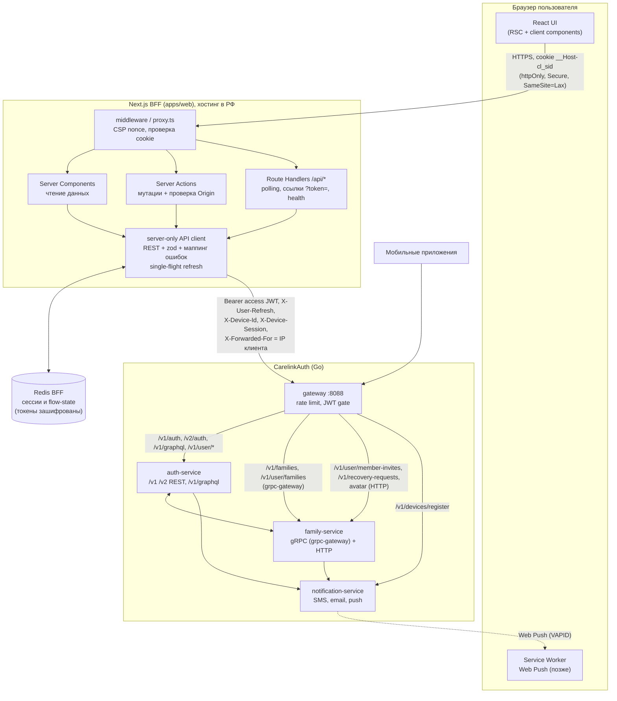
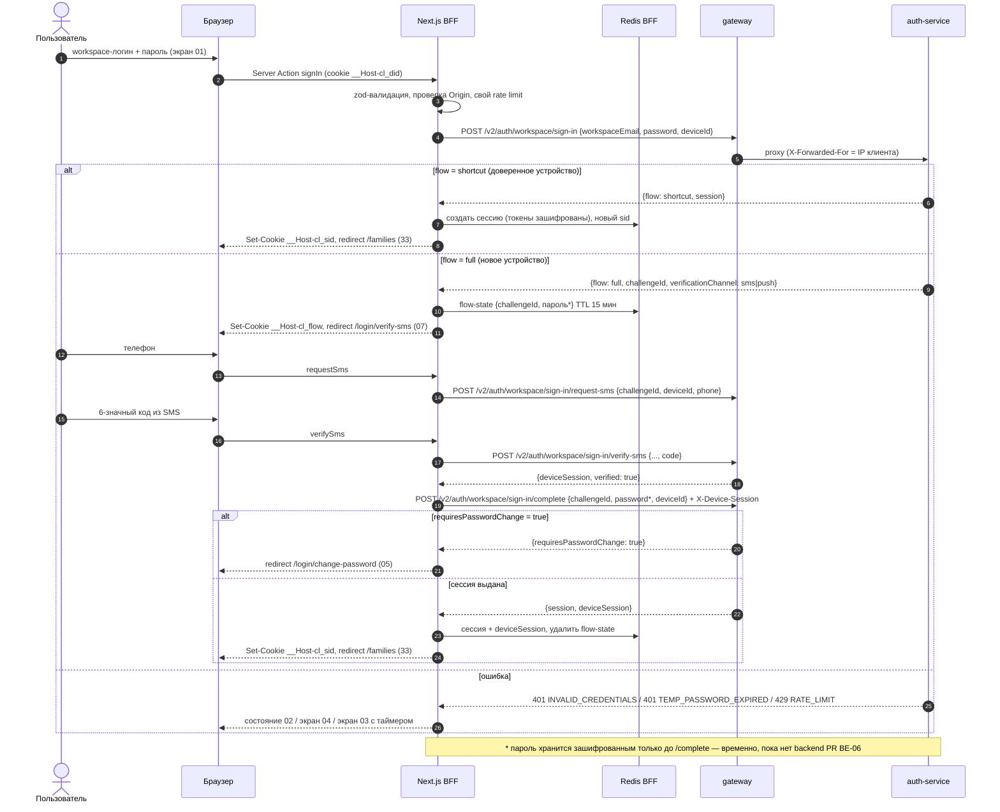
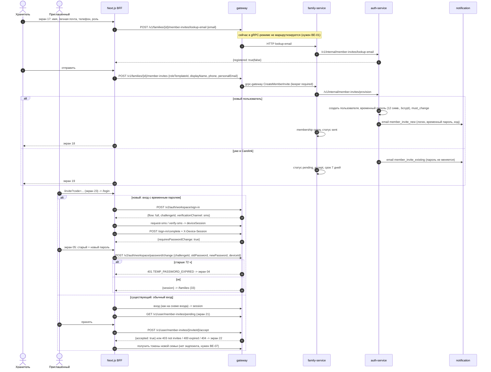

# Carelink Web — план реализации (Next.js BFF поверх CarelinkAuth)

> Документ-план. Кода приложения здесь нет — только решения, карта экранов, список доработок backend, этапы и критерии приёмки.
> Язык — простой: план для разработчика, который ещё осваивает собственный backend. Там, где что-то неясно, это помечено прямо (❓), а не додумано.

> **Репозиторий кода (2026-10-06):** Next.js-приложение живёт в **отдельном репо** [`SlavaYakimov/CarelinkWeb`](https://github.com/SlavaYakimov/CarelinkWeb) в **корне** (не `apps/web` в монорепо CarelinkAuth). CI, `AGENTS.md`, `.cursor/rules/web.mdc` и `Dockerfile` — здесь. Контракт auth синхронизируется в `contracts/auth.openapi.yaml` (`pnpm contracts:sync`). Job `web-e2e` против полного compose backend — **TODO** (приватный CarelinkAuth, нужен токен).

**На чём основано (проверено чтением кода, без запуска):**

- репозиторий `SlavaYakimov/CarelinkAuth`, ветка `main`, последний коммит `fbf2ce81` «Docs: sync guide after PR #118–#123 (#124)» от 4 окт 2026, 13:12 (UTC+5). Смёржены #118, #119, #121, #123, #124;
- файлы gateway: `services/gateway/internal/delivery/http/{server.go, family_gateway.go, family_http_fallback.go, family_recovery_proxy.go, device_register_proxy.go, wellknown.go}`, `services/gateway/internal/config/config.go`, `packages/resilience/ratelimit.go`;
- auth: `services/auth/internal/delivery/http/server.go` (CORS), `delivery/rest/{handlers.go, workspace_handlers.go, device_handlers.go}`, `delivery/errors/httpstatus.go`, `usecase/{workspace, deviceverify, recovery, member_invite, auth}`, `internal/config/config.go`, `internal/netutil/clientip.go`, GraphQL SDL `delivery/graphql/schema.graphql`, `docs/backend/auth/openapi.yaml`;
- family: `delivery/http/handlers.go`, `delivery/grpc/errors.go`, `usecase/onboarding/service_impl.go`, proto `packages/proto/carelink/family/v1/*_service.proto`;
- notification: `usecase/device_platform.go`, миграции шаблонов `006`, `012`;
- `docker-compose.yml`, `e2e/docker-compose.e2e.yml`, `e2e/otp.py`, `e2e/push_verify.py`, `Makefile`;
- раздел «9. Несоответствия в коде» в `docs/guide/index.html` (версия после #124: 30 осталось, 13 исправлено);
- макеты Stitch: `/workspace/carelink-stitch/{IMPLEMENTATION.md, flow.md, DESIGN.md, html/*.html}` (проект `14827692815693858895`).

Ничего не запускалось; все утверждения про поведение — по чтению кода. Где поведение надо подтвердить прогоном, стоит ❓.

---

## 0. Коротко (TL;DR)

1. Веб — **Next.js (App Router, TypeScript) в роли BFF**. Браузер не видит ни access JWT, ни refresh, ни `deviceSession`. Токены лежат на сервере в Redis (зашифрованными), у браузера только cookie со случайным id сессии: `httpOnly`, `Secure`, `SameSite=Lax`, префикс `__Host-`.
2. **С backend говорим по REST** (`/v2/auth/*`, `/v1/*` через gateway). В GraphQL нет нужных полей (`verificationChannel`, `deviceSession`, `deviceRegistrationToken`, `KEEPER_NOT_FOUND`) и нет приглашений, восстановления и устройств. GraphQL используем в одном месте — `query me` для профиля, пока нет REST `GET /v1/user/me` (BE-18).
3. CORS для веба **не нужен**: браузер ходит только на свой домен, а BFF вызывает gateway с сервера. Зато BFF обязан передавать реальный IP клиента, иначе лимиты gateway (30 запросов/мин на auth-маршруты, ключ — IP) сработают на всех пользователей разом.
4. Из 40 экранов **около 24 можно сделать на текущем `main`**. Остальным нужны доработки backend: список участников семьи, список заявок, доставка `requestId` восстановления пользователю, статус и детали делегированного входа, маршрутизация части family-маршрутов в gRPC-режиме, нормальные коды ошибок grpc-gateway, токены для новой семьи после принятия приглашения, `platform=web` для Web Push.
5. Доработки backend — **26 маленьких PR** (BE-01…BE-26). Шесть из них нужны уже на этапе 0.
6. Репозиторий: **`apps/web` внутри монорепо CarelinkAuth** — контракт и backend меняются часто, e2e на docker-compose уже живёт там.
7. Хостинг BFF и его Redis — **в РФ** (152-ФЗ: локализация ПДн, а данные о здоровье — специальная категория). Никаких Vercel, Google Fonts, GA. Шрифты — свои (self-hosted).
8. Этапы: 0 подготовка → 1 вход A/B/C → 2 онбординг D → 3 приглашения и вступление E/F → 4 восстановление G → 5 семьи H → 6 профиль I → 7 hardening. У каждого этапа есть критерии на Gherkin (Дано/Когда/Тогда).

---

## 1. Архитектура

### 1.1 Почему BFF, а не SPA с токенами в браузере

- Данные чувствительные: телефоны, семья, позже здоровье. Токен в `localStorage` украдёт любой XSS. Токен в httpOnly-cookie на сервере BFF — нет.
- Backend спроектирован под мобильный клиент: много заголовков (`X-Device-Session`, `X-User-Refresh`, `X-Scope`), несколько токенов на семью, `deviceSession` как отдельный секрет. Прятать всё это за BFF проще и безопаснее, чем учить браузер.
- Сессия backend — это `{defaultFamilyId, userRefresh, families:[{familyId, access, refresh, expiresAt}]}` (`usecase/auth/service.go`, `SessionResponse`). При нескольких семьях это несколько JWT и refresh — в cookie (лимит 4 КБ) не влезет. Поэтому храним на сервере.

### 1.2 REST или GraphQL — решение

**Решение: REST. GraphQL — только `query me` (временно).**

| Что нужно вебу                                          | REST (через gateway)       | GraphQL (`/v1/graphql`)                      |
| ------------------------------------------------------- | -------------------------- | -------------------------------------------- |
| `verificationChannel` после sign-in (push/sms)          | есть                       | **нет** в `WorkspaceSignInPayload`           |
| `deviceSession` в ответе complete                       | есть                       | **нет** в `WorkspaceSignInCompletePayload`   |
| `userId` + `deviceRegistrationToken` после verify-phone | есть (#121)                | **нет**                                      |
| подтверждение устройства (push/SMS/ссылка)              | есть                       | **нет** мутаций                              |
| pair phone OTP (`/v2/auth/pair/phone/*`)                | есть                       | **нет**                                      |
| приглашения, роли, заявки, recovery, журнал             | есть (family)              | **нет**                                      |
| устройства и отзыв                                      | есть                       | **нет**                                      |
| `KEEPER_NOT_FOUND`                                      | есть (404)                 | **нет** в enum                               |
| профиль (чтение)                                        | **нет** `GET /v1/user/me`  | `query me` (без `avatarUrl`)                 |
| лимит gateway                                           | auth-маршруты 30/мин на IP | весь `/v1/graphql` в «чувствительном» лимите |

Вывод: GraphQL сейчас — подмножество REST, местами с ошибками. Чтобы не держать два клиента, весь веб на REST. `me` вызываем одним server-side fetch'ем, пока не появится BE-18.

### 1.3 Cookie

Префикс `__Host-` требует `Secure`, `Path=/` и запрещает `Domain`. Локально по http префикс не работает — в dev имена без префикса (настраивается env).

| Cookie           | Содержимое                                                                       | Флаги                          | Срок                         |
| ---------------- | -------------------------------------------------------------------------------- | ------------------------------ | ---------------------------- |
| `__Host-cl_sid`  | случайный id сессии (32 байта, base64url)                                        | httpOnly, Secure, SameSite=Lax | равен сроку серверной сессии |
| `__Host-cl_flow` | id незавершённого сценария (вход, онбординг, вступление, восстановление)         | httpOnly, Secure, SameSite=Lax | 15–30 мин                    |
| `__Host-cl_did`  | `deviceId` браузера (UUID v4, генерирует сервер; backend требует 8–128 символов) | httpOnly, Secure, SameSite=Lax | 400 дней (максимум Chrome)   |

Почему `Lax`, а не `Strict`: со `Strict` переход по ссылке из письма или push (`/invite`, `/device/verify`, `/onboarding/verify-email`) придёт без cookie. Пользователь будет выглядеть разлогиненным, а flow — потерянным. От CSRF защищаемся отдельно (§1.7).

`deviceId` не кладём в `localStorage`, как предлагал IMPLEMENTATION.md: httpOnly-cookie недоступна JS и живёт столько же. Backend привязывает к `deviceId` доверие устройству (`device_trust`), `deviceSession` и refresh-токены.

### 1.4 Что лежит в Redis BFF

Отдельный Redis (или отдельная БД и пароль), не общий с backend. Значения шифруются AES-256-GCM ключом `SESSION_ENC_KEY`; есть `SESSION_ENC_KEY_PREVIOUS` для ротации.

```
sess:{sid} = {
  userId, defaultFamilyId, activeFamilyId,
  userRefresh,                                   // opaque, scope=user
  families: { [familyId]: { access, refresh, expiresAt } },
  deviceSession,                                 // для DELETE /v2/auth/devices, finalize, POST /v1/families (auth-режим)
  createdAt, lastSeenAt
}                                                // TTL = idle-таймаут, плюс абсолютный предел
flow:{fid} = { kind: "signin"|"onboarding"|"join"|"recovery"|"invite",
               challengeId?, onboardingChallengeId?, userId?, userRefresh?,
               deviceRegistrationToken?, sessionId?, requestId?, approvalSecret?,
               inviteCode?, step }  // TTL 15–30 мин
dv:{challengeId} = { deviceSession }                 // для push-ссылки, открытой в другой вкладке/на телефоне (этап 6)
lock:refresh:{sid}:{familyId}                         // single-flight refresh (§1.6)
rl:{bucket}:{key}                                     // собственный rate limit BFF
```

BE-06 (смёржен): после `sign-in` с тем же `deviceId` challenge помечен «пароль проверен» — `POST …/sign-in/complete` принимает только `{challengeId, deviceId}` и заголовок `X-Device-Session` после SMS/делегирования. Временный пароль при смене (`password/change`) вводится на форме, не хранится в `flow`.

### 1.5 Как BFF вызывает gateway

- Базовый URL — `GATEWAY_URL`, внутренний адрес в частной сети провайдера. Таймаут 10 с, для GET один повтор при сетевой ошибке. POST без `Idempotency-Key` не повторяем никогда.
- Заголовки:
  - `Authorization: Bearer <access семьи из URL>`. Выбор токена: для `/families/[familyId]/…` — access этой семьи; иначе `activeFamilyId`.
  - `X-User-Refresh` — только для `onboarding/password/setup`.
  - `X-Device-Id` и `X-Device-Session` — где требует `requireDeviceSession`.
  - `X-Trace-Id` — UUID на каждый запрос. Обязателен для `/v1/devices/register`, иначе 400. Пишем его в свои логи.
  - `Idempotency-Key` — UUID на одну попытку пользователя: создаётся при рендере формы и лежит в hidden-поле. Нужен для `POST /v1/families` и создания приглашения.
  - `X-Forwarded-For: <IP клиента>` и `X-Real-IP`. Gateway (`resilience.ClientIP`) и auth (`netutil.ClientIP`) берут первый IP из `X-Forwarded-For`. Без этого все пользователи веба делят один лимит 30/мин. Сейчас gateway доверяет XFF от кого угодно — это закрывает BE-03.
  - `Accept: application/json` — в том числе для `GET …/onboarding/email/verify-link`: с `text/html` он отвечает 302 на `carelink://…`.
- Ответы проверяем zod-схемами. Неожиданная форма → ошибка `CONTRACT_MISMATCH` в логе (без тела) и общий экран ошибки.
- Ошибки приводим к одному виду `{ code: string, httpStatus, retryAfter? }`. Форм четыре:
  1. auth REST — `{"code":"INVALID_CREDENTIALS","message":"…"}`;
  2. family HTTP — то же;
  3. лимитер gateway — `{"code":"RATE_LIMIT"}` плюс заголовок `Retry-After`;
  4. **grpc-gateway (family в gRPC-режиме)** — `{"code": <число gRPC>, "message", "details"}`. Сейчас `FORBIDDEN`, `RATE_LIMIT` и `NOT_IMPLEMENTED` из family превращаются там в `codes.Internal` → HTTP 500 (`family/internal/delivery/grpc/errors.go`). Исправляет BE-02.

### 1.6 Обновление токенов (refresh)

Факты из кода (`usecase/auth/service.go`, `refresh_scope.go`, `config.go`):

- access живёт 15 мин (`ACCESS_TOKEN_TTL`), refresh — 30 дней (`REFRESH_TOKEN_TTL`);
- refresh семьи меняется через `POST /v1/auth/token/refresh {refresh}` с заголовком `X-Scope: family:<id>`. Ответ — новый `{familyId, access, refresh, expiresAt}`, старый refresh отзывается;
- `userRefresh` (`X-Scope: user`) умеет только обновить сам себя: `{"userRefresh": "..."}`. Токенов новой семьи он не даёт;
- **повторное предъявление уже отозванного refresh → backend отзывает ВСЕ токены пользователя** (`audit.refresh_reuse`).

Отсюда правило: **single-flight refresh**. Если два параллельных запроса (RSC и Server Action) одновременно увидят истёкший access и оба пойдут обновлять, второй предъявит уже отозванный refresh — и пользователь вылетит на всех устройствах. Алгоритм (схема — `refresh-sequence.png`):

1. Перед вызовом: если `expiresAt - now < 60 с`, обновляем.
2. Берём lock `SET lock:refresh:{sid}:{familyId} NX PX 5000`. Кто не получил lock — ждёт до 5 с и перечитывает сессию.
3. На 401 `TOKEN_EXPIRED` от бизнес-вызова: один раз refresh и один повтор.
4. Refresh ответил 401 → удаляем сессию → `/session-ended` (экран 40). Отличить «заблокирован хранителем» (32) от «отозвано» (40) сейчас нельзя: оба 401 `UNAUTHORIZED`. Нужен BE-09.
5. Новая семья (принял приглашение, создал семью, одобрили заявку) — токенов для неё нет без нового входа. Нужен BE-07: «пересобрать сессию по userRefresh».

### 1.7 CSRF

- Все мутации — **Server Actions**. Next принимает их только POST'ом и сверяет `Origin` с `Host`. В `next.config` указываем `serverActions.allowedOrigins` = только наш домен.
- Route Handlers (`/api/*`) — только GET без побочных эффектов: polling, health. Исключение — приём `?token=`-ссылок, и они тоже ничего не меняют на GET (см. §1.9).
- Для любого POST Route Handler (если появится): проверка `Origin` плюс заголовок `X-CL-CSRF`, равный значению из сессии (synchronizer token).
- `SameSite=Lax` — второй слой.

### 1.8 Защита маршрутов

- `middleware.ts` (в Next 16 — `proxy.ts`) делает только дешёвые вещи: генерирует nonce для CSP, ставит security-заголовки и, если на `(app)`-маршрут пришли без `__Host-cl_sid`, редиректит на `/login?next=…` (только относительные `next`, защита от open redirect). В Redis middleware не ходит.
- Настоящая проверка — в `app/(app)/layout.tsx`: `getSession()` читает Redis. Нет сессии → `redirect('/login')`.
- Права на семью проверяет backend: family отвечает `NOT_FOUND` 404 / `FORBIDDEN` 403, auth на approve — 401 / `KEEPER_NOT_FOUND`. BFF показывает 404-страницу или экран 28 и **не пытается угадывать роль сам**. Роль из `/v1/user/families` (`role`) используем только чтобы прятать кнопки, но не как защиту.
- Пред-сессионные шаги (`/login/verify-sms`, `/onboarding/*`, `/join/*`, `/recovery/confirm`) требуют живой `__Host-cl_flow` нужного вида и шага. Иначе — на начало сценария.

### 1.9 Ссылки с `?token=` (письма, push)

Это ссылки на подтверждение почты в онбординге (`ONBOARDING_MAGIC_LINK_BASE_URL`), push-подтверждение устройства (`DEVICE_VERIFY_MAGIC_LINK_BASE_URL`; тот же base у делегированного входа) и приглашение (`INVITE_LINK_BASE_URL/invite?code=`). Правила:

1. Страница-приёмник **не вызывает backend на GET**. Она показывает кнопку «Подтвердить», и только POST (Server Action) обращается к backend. Почтовые сканеры и превью мессенджеров открывают ссылки сами, а `verify-link`/`delegate-link` одноразовые: GET их «съедает» (`ConsumeDeviceVerifyLinkJTI`), а `GET …/delegate-link` вообще одобряет вход.
2. Токен сразу переносим из URL в `flow` и делаем `redirect` на чистый URL. Ставим `Referrer-Policy: no-referrer`.
3. Base URL этих ссылок рекомендуется направить на домен веба (`https://<web>/…`). Тогда у кого стоит приложение, ссылку перехватят universal links, у остальных откроется веб. Для этого веб отдаёт `/.well-known/apple-app-site-association` и `assetlinks.json` с путями `/invite`, `/device/verify`, `/onboarding/verify-email`, `/delegate`, `/recovery/*`. Сейчас их отдаёт gateway, и в списке нет device/onboarding/delegate (`wellknown.go`). См. Q2.

### 1.10 Диаграммы

Исходники — `diagrams/*.mmd`, превью — PNG рядом с этим файлом.

**Архитектура** — `architecture.png`




**Вход (01 → 07 → complete)** — `login-sequence.png`




**Приглашение и временный пароль** — `invite-sequence.png`




**Refresh (single-flight)** — `refresh-sequence.png` (исходник в `diagrams/refresh-sequence.mmd`).


---

## 2. Карта: 40 экранов → маршрут Next.js → endpoint backend

**Условные обозначения**

- ✅ — есть в `main` и доходит через gateway в конфигурации `docker-compose.yml`. Это gRPC-режим: у gateway задан `FAMILY_GRPC_ADDR`, и `/v1/families/*` идёт в grpc-gateway family.
- ⚠️ — есть, но с оговоркой: не маршрутизируется, неправильный код ошибки, выключен флагом или неудобно для веба.
- ❌ — в коде нет.
- ❓ — неясно, надо проверить прогоном.

Пути: `/v2/auth/workspace/sign-in/...` сокращены до `…/sign-in/...`. Маршруты веба: `(public)` — без сессии, `(app)` — с сессией.

| №   | Экран                               | Маршрут Next.js                                                 | Endpoint(ы) backend                                                                                                                                                                                                                  | Статус           | Примечание                                                                                                                                                                                                                                     |
| --- | ----------------------------------- | --------------------------------------------------------------- | ------------------------------------------------------------------------------------------------------------------------------------------------------------------------------------------------------------------------------------ | ---------------- | ---------------------------------------------------------------------------------------------------------------------------------------------------------------------------------------------------------------------------------------------- |
| 01  | Вход — Workspace                    | `/login`                                                        | `POST /v2/auth/workspace/sign-in {workspaceEmail, password, deviceId}`                                                                                                                                                               | ✅               | `deviceId` из `__Host-cl_did`. Ответ: `shortcut`+`session` или `full`+`challengeId`+`verificationChannel`. В ветке «новое устройство» флаг `requiresPasswordChange` не приходит — он появится на `/complete`                                   |
| 02  | Вход — неверный пароль              | `/login` (состояние формы)                                      | тот же → 401 `INVALID_CREDENTIALS`; 404 `WORKSPACE_NOT_FOUND`                                                                                                                                                                        | ✅               | `WORKSPACE_NOT_FOUND` показываем тем же общим текстом, иначе можно перебирать адреса семей (§4.10)                                                                                                                                             |
| 03  | Слишком много попыток               | `/login/too-many` + inline-таймер                               | любой → 429 `RATE_LIMIT`                                                                                                                                                                                                             | ⚠️               | `Retry-After` ставит только лимитер gateway. Доменные 429 auth (sign-in, OTP, recovery, смена пароля) приходят без него → BE-10. Запасной таймер — 60 с                                                                                        |
| 04  | Временный пароль истёк              | `/login/temp-expired`                                           | 401 `TEMP_PASSWORD_EXPIRED` от sign-in, complete, password/change                                                                                                                                                                    | ✅               | 401 вместо 500 — исправлено в #119                                                                                                                                                                                                             |
| 05  | Смена временного пароля             | `/login/change-password`                                        | `POST /v2/auth/workspace/password/change {challengeId, oldPassword, newPassword, deviceId}` → `{session}`                                                                                                                            | ✅               | Лимит 15/ч на IP. Ошибки: `WEAK_PASSWORD`, `INVALID_CREDENTIALS`, 400 «password change not required». ⚠️ Смена возможна сразу после sign-in, без подтверждения устройства (BE-22, Q4)                                                          |
| 06  | Подтверждение устройства — push     | `/login/verify-push`, приёмник `/device/verify?token=`          | `POST …/sign-in/request-push-verify`, `…/resend-push-verify`; `GET …/sign-in/verify-link?token=` → `{deviceSession, challengeId, clientDeviceId}`; `POST …/sign-in/complete` + `X-Device-Session`                                    | ⚠️               | Для браузера `channel=push` не бывает, пока notification принимает только `ios`/`android` (`device_platform.go`) → BE-04. Base ссылки — `DEVICE_VERIFY_MAGIC_LINK_BASE_URL`, один для приложений и веба. В MVP экран не используется           |
| 07  | Подтверждение устройства — SMS      | `/login/verify-sms`                                             | `POST …/sign-in/request-sms {challengeId, deviceId, phone}`; `POST …/sign-in/verify-sms {…, code}` → `{deviceSession}`; `POST …/sign-in/complete`                                                                                    | ✅ / ⚠️          | `/complete` снова требует пароль → BE-06; пока — зашифрованный пароль в flow (§1.4)                                                                                                                                                            |
| 08  | Подтверждение телефона              | `/login/verify-phone`                                           | `POST …/sign-in/start`; `…/sign-in/request-otp {challengeId, phone}`; `…/sign-in/verify-phone {challengeId, phone, code}` → `{phoneVerified, userId, deviceRegistrationToken}`                                                       | ✅               | `userId`+`deviceRegistrationToken` отдаются с #121 (в GraphQL их нет). Для веба путь необязателен: нужен, только если регистрировать Web Push до появления сессии                                                                              |
| 09  | Вход через хранителя — ожидание     | `/login/keeper`                                                 | `POST …/sign-in/request-delegate-push {challengeId, deviceId}`; затем `POST …/sign-in/complete` без `X-Device-Session`                                                                                                               | ⚠️ ❓            | Эндпоинта статуса нет: придётся опрашивать `/complete` (каждый раз с паролем). ❓ Какой код вернётся до одобрения. 403 `DELEGATE_NOT_ALLOWED`, если хранителя нет. Всё это → BE-11                                                             |
| 10  | Хранитель: подтвердить вход         | `/delegate?token=`                                              | `POST /v2/auth/workspace/sign-in/approve-delegate {token}`                                                                                                                                                                           | ⚠️               | Хранитель не авторизуется: одобряет любой, у кого есть ссылка. Ответ содержит `deviceSession` участника. `GET …/delegate-link` одобряет прямо на GET. Деталей (кто, устройство, IP, время) ❌ и кнопки «Отклонить» ❌ нет → BE-11              |
| 11  | Онбординг — почта                   | `/onboarding/email`, приёмник `/onboarding/verify-email?token=` | `POST /v2/auth/onboarding/email/request {email}`; `…/email/verify {email, code}`; `GET …/email/verify-link?token=`                                                                                                                   | ✅               | `verify-link` вызываем с `Accept: application/json` (иначе 302 на `carelink://`). `ONBOARDING_MAGIC_LINK_BASE_URL` → веб                                                                                                                       |
| 12  | Онбординг — телефон                 | `/onboarding/phone`                                             | `POST …/phone/request-otp {onboardingChallengeId, phone}`; `…/phone/verify {…, code, displayName}` → `{userId, deviceRegistrationRequired, deviceRegistrationToken, existingUser}`                                                   | ✅               | `existingUser=true` — второй онбординг: экран выбора `/onboarding/existing` (12a) со списком семей `workspaces` (BE-27)                                                                                                                        |
| 13  | Онбординг — устройство              | `/onboarding/device`                                            | SMS: `POST …/device/verify/request-sms`, `…/device/verify/verify-sms` → `deviceSession`; `POST …/device/confirm` + `X-Device-Session` → `{userRefresh}`. Push: `POST /v1/devices/register` + `…/device/verify/request-push`          | ✅ SMS / ❌ push | Web Push: `platform=web` notification не принимает (BE-04). В MVP — только SMS                                                                                                                                                                 |
| 14  | Онбординг — пароль                  | `/onboarding/password`                                          | `POST …/password/setup` (`X-User-Refresh`) `{onboardingChallengeId, newPassword, deviceId}` → `{session, requiresWorkspaceFinalize}`                                                                                                 | ✅               |                                                                                                                                                                                                                                                |
| 15  | Онбординг — адрес семьи             | `/onboarding/workspace`                                         | `POST …/workspace/finalize` (Bearer + `X-Device-Id` + `X-Device-Session`) `{onboardingChallengeId, workspaceSlug, displayName}`                                                                                                      | ✅               | Проверки «адрес свободен» до отправки нет ❌ (BE-25, опционально). Есть 409 `WORKSPACE_SLUG_TAKEN`                                                                                                                                             |
| 16  | Онбординг — семья создана           | `/onboarding/done`                                              | — (данные из ответа finalize, лежат во flow)                                                                                                                                                                                         | ✅               |                                                                                                                                                                                                                                                |
| 17  | Пригласить — форма                  | `/families/[familyId]/invites/new`                              | `GET /v1/families/{id}/role-templates` ✅; `POST …/member-invites/lookup-email {email}` ⚠️; `POST …/member-invites/avatar` (multipart) ✅; `POST …/member-invites {roleTemplateId, displayName, phone, personalEmail, avatarUrl}` ✅ | ⚠️               | `lookup-email` в gRPC-режиме даёт 404 (нет в proto, нет HTTP-fallback) → BE-01. 403 «keeper required» через grpc-gateway превращается в 500 → BE-02. Нужен флаг family `WORKSPACE_MEMBER_INVITE_EMAIL_ENABLED=true` (по умолчанию false → 501) |
| 18  | Отправлено — новый                  | `/families/[id]/invites/sent?kind=new`                          | ответ create `{inviteId, emailSent}`                                                                                                                                                                                                 | ⚠️               | Ответ не говорит, новый человек или существующий. Решаем по результату lookup перед отправкой; BE-16 добавит поле                                                                                                                              |
| 19  | Отправлено — уже в Carelink         | `/families/[id]/invites/sent?kind=existing`                     | то же                                                                                                                                                                                                                                | ⚠️               | то же                                                                                                                                                                                                                                          |
| 20  | Приглашения семьи                   | `/families/[id]/invites`                                        | `GET /v1/families/{id}/member-invites`                                                                                                                                                                                               | ✅               | Список видит любой участник, вместе с телефонами приглашённых (BE-23, минимизация ПДн)                                                                                                                                                         |
| 21  | Входящие приглашения                | `/invites`                                                      | `GET /v1/user/member-invites/pending`; `POST /v1/user/member-invites/{inviteId}/accept` и `/decline`                                                                                                                                 | ✅ / ⚠️          | В элементе списка нет названия семьи: `displayName` там — имя приглашённого (BE-16). После accept токенов новой семьи не получить → BE-07                                                                                                      |
| 22  | Приглашение недоступно              | `/invites/unavailable?reason=`                                  | accept/decline → 403 «not invitee», 400 «invite expired» / «invite not pending», 404                                                                                                                                                 | ✅               |                                                                                                                                                                                                                                                |
| 23  | Приглашение по ссылке               | `/invite?code=`                                                 | — (предпросмотра по коду нет)                                                                                                                                                                                                        | ❌               | MVP: статичная страница, `code` сохраняем во flow. Показать «Семья Ивановы приглашает» нельзя без BE-17. `code` — это код pairing-сессии (`createMemberInviteByEmail`)                                                                         |
| 24  | Вступление по коду                  | `/join`                                                         | `POST /v1/auth/pair/resolve {sessionId}`                                                                                                                                                                                             | ❓               | `resolve` требует `sessionId` (UUID), а в письме только код, SMS-шаблон `member_invite` кода не содержит вовсе. Resolve по коду нет → BE-17 / Q1                                                                                               |
| 25  | Вступление — телефон и имя          | `/join/phone`                                                   | `POST /v2/auth/pair/phone/request-otp {phone}`; `…/pair/phone/verify {phone, code}` → `registrationToken`; `POST /v1/auth/pair/confirm {sessionId, code, name, registrationToken, unionRole}` → `{requestId, approvalSecret}`        | ✅ / ⚠️          | 409 `PHONE_REGISTERED` раскрывает, что номер есть в системе. `/v2/auth/pair/` не попадает в «чувствительный» лимит gateway (BE-03). `email`/`password` в confirm игнорируются                                                                  |
| 26  | Вступление — ожидание               | `/join/pending`                                                 | `POST /v1/auth/pair/approval-status {requestId, approvalSecret}` (опрос)                                                                                                                                                             | ✅               | `approved` → сразу `session` (вход). GraphQL-подписку не используем                                                                                                                                                                            |
| 27  | Хранитель: заявки                   | `/families/[id]/join-requests`                                  | список ❌; `POST /v1/auth/pair/approve {requestId}` ✅; `POST /v1/auth/pair/reject {requestId}` ✅ (Bearer хранителя)                                                                                                                | ❌ / ✅          | Без списка экран не собрать → BE-13. 401, если не хранитель; 404 `KEEPER_NOT_FOUND`, если хранителя нет (#123); повторный approve → 500 (BE-24). Выбора роли при одобрении в API нет (роль = `roleLabel` сессии) — в макете убрать             |
| 28  | Нет прав хранителя                  | `/forbidden` + inline                                           | —                                                                                                                                                                                                                                    | ✅               | Ведут сюда: `KEEPER_NOT_FOUND` 404, `UNAUTHORIZED` 401 на approve/reject, `FORBIDDEN` 403 (family HTTP), `NOT_FOUND` 404 на recovery, `DELEGATE_NOT_ALLOWED` 403                                                                               |
| 29  | Восстановление — запрос             | `/recovery`                                                     | `POST /v2/auth/recovery/request {familySlug, phone}` → 202 `{accepted, message}`                                                                                                                                                     | ✅               | При `RECOVERY_ENABLED=false` (по умолчанию) ответ тот же, но ничего не происходит                                                                                                                                                              |
| 30  | Восстановление — новый пароль       | `/recovery/confirm`                                             | `POST /v2/auth/recovery/confirm {requestId, code, newPassword, phone, deviceId}` → session                                                                                                                                           | ❌               | `requestId` до пользователя не доходит: SMS `recovery_code` содержит только `code`, а `request` возвращает одинаковый ответ без id → BE-14. Неодобренный запрос → 500                                                                          |
| 31  | Хранитель: запрос на восстановление | `/families/[id]/recovery/[requestId]`                           | `GET /v1/recovery-requests/{id}?familyId=`; `POST …/{id}/approve {phone}`, `…/reject`, `…/lock`                                                                                                                                      | ✅ / ⚠️          | Телефон для кода вводит хранитель (любой номер) → BE-14. Откуда хранитель в вебе узнаёт `id`: списка нет, есть только push с `carelink://recovery/request?id=` ❌ → BE-15                                                                      |
| 32  | Аккаунт заблокирован                | `/locked`                                                       | refresh/sign-in → 401 (не отличить от отзыва); разблокировка: `POST /v1/families/{id}/members/{userId}/unlock`                                                                                                                       | ⚠️               | BE-09 (отдельный код). `unlock` в gRPC-режиме не маршрутизируется (BE-01)                                                                                                                                                                      |
| 33  | Главная — мои семьи                 | `/families`                                                     | `GET /v1/user/families?page&limit`; `GET /v1/user/member-invites/pending` (бейдж)                                                                                                                                                    | ✅               | FamilySummary: `id, name, member_count, role, is_default, workspace_slug, workspace_email, …`                                                                                                                                                  |
| 34  | Семья — участники                   | `/families/[id]`                                                | список участников ❌; `GET …/member-invites` ✅; `GET …/role-templates` ✅; `unlock` ⚠️                                                                                                                                              | ❌               | BE-12. Статуса «в сети», телефонов, списка заблокированных в API нет                                                                                                                                                                           |
| 35  | Создать семью                       | `/families/new`                                                 | `POST /v1/families` → в gRPC-режиме family `CreateFamily {name, unionRole, workspaceSlug}`                                                                                                                                           | ⚠️ ❓            | Ответ без `session` → токены новой семьи только через BE-07. В non-gRPC режиме запрос уходит в auth: нужен `X-Device-Session`, slug не поддерживается, но `session` есть                                                                       |
| 36  | Журнал безопасности                 | `/families/[id]/security`                                       | `GET /v1/families/{id}/security-audit`                                                                                                                                                                                               | ⚠️               | В gRPC-режиме не маршрутизируется (BE-01). Фильтры в API ❓. Кто может читать — проверить (IDOR-тест)                                                                                                                                          |
| 37  | Профиль и аватар                    | `/profile`                                                      | GraphQL `query { me { userId displayName avatarUrl } }`; `PATCH /v1/user/me {displayName}`; `POST /v1/user/me/avatar` (multipart `file`)                                                                                             | ⚠️               | REST для чтения профиля нет; `me` не заполняет `avatarUrl`; сохраняется ли `avatarUrl` в профиле ❓ → BE-18. Workspace-логин берём из `/v1/user/families`. Телефона в API нет                                                                  |
| 38  | Устройства и сессии                 | `/devices`                                                      | `GET /v2/auth/devices`; `DELETE /v2/auth/devices/{clientDeviceId}` (+`X-Device-Id`, `X-Device-Session`); `POST /v1/auth/logout {refresh, allDevices}`                                                                                | ⚠️               | Список строится по устройствам из notification: браузер без регистрации там не появится (BE-04a). Браузера/ОС/города нет (только `platform, lastSeenAt, trusted, active`). Выход на одном устройстве отзывает один refresh (BE-08)             |
| 39  | Уведомления                         | `/notifications`                                                | inbox ❌; `POST /v1/devices/register` (`platform=web` ❌)                                                                                                                                                                            | ❌               | MVP — сводка из входящих приглашений (есть) и заявок/восстановлений (BE-13, BE-15). Полный inbox — BE-19, Web Push — BE-04b. Настроек email/SMS в API нет                                                                                      |
| 40  | Сессия завершена                    | `/session-ended`                                                | `POST /v1/auth/token/refresh` → 401                                                                                                                                                                                                  | ✅               |                                                                                                                                                                                                                                                |

Служебные маршруты веба (не экраны): `/device/verify` (приёмник push-ссылки), `/api/flow/status` (опрос для 06/09/26), `/api/health`, `/.well-known/*` (universal links, §1.9).

### 2.1 Коды ошибок → поведение UI

Один модуль `src/server/gateway/errors.ts` (маппинг) плюс тексты в `messages/ru.json`.

| Код (HTTP)                                                                                                  | Откуда                                           | UI                                                                                                                     |
| ----------------------------------------------------------------------------------------------------------- | ------------------------------------------------ | ---------------------------------------------------------------------------------------------------------------------- |
| `INVALID_CREDENTIALS` (401)                                                                                 | sign-in, complete, password/change, verify-phone | 02: «Неверный адрес семьи или пароль» (одинаково для всех случаев)                                                     |
| `WORKSPACE_NOT_FOUND` (404)                                                                                 | sign-in                                          | тот же текст, что для 02                                                                                               |
| `RATE_LIMIT` (429)                                                                                          | gateway, auth, family                            | 03 или inline-таймер (`Retry-After`, иначе 60 с)                                                                       |
| `TEMP_PASSWORD_EXPIRED` (401)                                                                               | sign-in, complete, password/change               | 04                                                                                                                     |
| `WEAK_PASSWORD` (400)                                                                                       | password/change, setup, recovery                 | ошибка под полем                                                                                                       |
| `INVALID_OTP` (400)                                                                                         | все OTP, verify-link, delegate                   | ошибка под полем; после 5 попыток backend блокирует, но код тот же → после 5-й ошибки показываем «Запросите новый код» |
| `SMS_UNDELIVERED`, `EMAIL_UNDELIVERED`, `DEVICE_VERIFY_UNDELIVERED`, `STORAGE_UNAVAILABLE`, `OFFLINE` (503) | доставка                                         | баннер «Не удалось отправить» + повтор                                                                                 |
| `DEVICE_REGISTRATION_REQUIRED` (403)                                                                        | push verify                                      | переключить на SMS (07)                                                                                                |
| `DEVICE_SESSION_REQUIRED` (403)                                                                             | finalize, отзыв устройства, `POST /v1/families`  | заново подтвердить устройство по SMS                                                                                   |
| `DEVICE_MISMATCH` (403)                                                                                     | то же                                            | backend отзывает токены устройства → 40                                                                                |
| `DELEGATE_NOT_ALLOWED` (403)                                                                                | delegate                                         | 09: «Хранитель недоступен», 10: 28                                                                                     |
| `KEEPER_NOT_FOUND` (404)                                                                                    | pair approve/reject                              | 28                                                                                                                     |
| `UNAUTHORIZED` / `TOKEN_EXPIRED` (401)                                                                      | любой защищённый                                 | refresh → повтор → 40                                                                                                  |
| `PHONE_REGISTERED` (409)                                                                                    | pair phone OTP                                   | «Номер уже в Carelink — войдите» → 01                                                                                  |
| `EMAIL_TAKEN` (409)                                                                                         | onboarding email                                 | ошибка под полем + ссылка на вход                                                                                      |
| `WORKSPACE_SLUG_TAKEN` (409; через grpc-gateway — gRPC 6 `AlreadyExists`)                                   | finalize, create family                          | ошибка под полем                                                                                                       |
| `ONBOARDING_STEP_ORDER`, `SIGN_IN_STEP_ORDER` (400)                                                         | онбординг, вход                                  | сбросить flow, начать сценарий заново                                                                                  |
| `PASSWORD_SETUP_REQUIRED` (403)                                                                             | finalize                                         | → `/onboarding/password`                                                                                               |
| `PAIR_SESSION_NOT_FOUND` (404), `PAIR_SESSION_EXPIRED` (400), `INVALID_PAIR_CODE` (400)                     | pairing                                          | 24: «Код не найден или истёк»                                                                                          |
| `RECOVERY_GONE` (410)                                                                                       | recovery confirm                                 | → 29 «Запросите заново»                                                                                                |
| `AVATAR_TOO_LARGE` (413)                                                                                    | аватары                                          | ошибка под полем «Файл слишком большой»                                                                                |
| `NOT_IMPLEMENTED` (501)                                                                                     | выключенные флаги                                | баннер «Функция пока недоступна»                                                                                       |
| `FORBIDDEN` (403), `NOT_FOUND` (404) — family HTTP                                                          | приглашения, recovery                            | 28 в контексте хранителя, иначе 404-страница                                                                           |
| gRPC-числа от grpc-gateway: 3→400, 5→404, 6→409, 7→403, 8→429, 16→401, 13→500                               | family в gRPC-режиме                             | нормализуем в те же коды; 13 (`Internal`) — общий экран ошибки до BE-02                                                |
| `UNKNOWN` (500) / прочее                                                                                    | —                                                | общий экран «Что-то пошло не так» + короткий `traceId` для поддержки                                                   |

---

## 3. Доработки CarelinkAuth для веба (каждая — отдельный маленький PR)

Размеры: **S** — до 1 дня с тестами, **M** — 2–3 дня, **L** — 4+ дней. Приоритет: **P0** — без этого этап не закрыть, **P1** — нужно для полного макета, **P2** — улучшение.
У каждого PR: unit-тесты, при смене контракта — правка `openapi.yaml`/SDL (CI это проверяет: `check-openapi.sh`, `check-graphql-schema.sh`), строка в `docs/guide`.

### 3.1 Сводка

| ID     | Что                                                                                                                                                                              | Сервис                             | Экраны         | Размер | Приор.             | Этап      |
| ------ | -------------------------------------------------------------------------------------------------------------------------------------------------------------------------------- | ---------------------------------- | -------------- | ------ | ------------------ | --------- |
| BE-01  | HTTP-fallback в gateway для `lookup-email`, `security-audit`, `members/{uid}/unlock`                                                                                             | gateway                            | 17, 32, 34, 36 | S      | P0                 | 0         |
| BE-02  | Полный маппинг ошибок family → gRPC и свой error handler grpc-gateway (`{"code":"<DOMAIN>"}`)                                                                                    | family, gateway                    | 17, 20, 28, 35 | S–M    | P0                 | 0         |
| BE-03  | Доверенные прокси для `X-Forwarded-For`; `/v2/auth/pair/` в «чувствительный» лимит; убрать мёртвый `/v1/auth/otp/`                                                               | gateway, auth, packages/resilience | все            | S      | P0                 | 0         |
| BE-04a | `platform=web` в реестре устройств (токен push необязателен)                                                                                                                     | notification, gateway              | 38, 06         | S      | P1                 | 6         |
| BE-04b | Провайдер Web Push (VAPID), шифрованное хранение subscription                                                                                                                    | notification                       | 06, 13, 39     | M      | P2                 | 6         |
| BE-05  | Ссылки на веб-домен + пути universal links (device/onboarding/delegate)                                                                                                          | auth (config), docs                | 06, 10, 11, 23 | S      | P1                 | 0         |
| BE-06  | Challenge «пароль проверен» → `/sign-in/complete` без повторного пароля                                                                                                          | auth                               | 07, 09         | S–M    | P1                 | 1         |
| BE-07  | `POST /v1/auth/session/rebuild`: по userRefresh выдать полную сессию по всем текущим семьям                                                                                      | auth                               | 21, 26, 35     | S–M    | P0                 | 3         |
| BE-08  | Logout текущего устройства: отозвать все refresh этого `deviceId`                                                                                                                | auth                               | 38             | S      | P2                 | 6         |
| BE-09  | Отдельный код `ACCOUNT_LOCKED` для sign-in/refresh заблокированного                                                                                                              | auth                               | 32, 40         | S      | P1                 | 4         |
| BE-10  | `Retry-After` у доменных 429 в auth                                                                                                                                              | auth                               | 03             | S      | P1                 | 1         |
| BE-11  | Делегированный вход: детали по токену, approve только залогиненным хранителем, reject, статус для ожидающего, не отдавать `deviceSession` одобряющему, GET без побочных эффектов | auth                               | 09, 10         | M      | P1                 | 1 (или 7) |
| BE-12  | `GET /v1/families/{id}/members` (роль, имя, аватар, `locked`)                                                                                                                    | family (+auth)                     | 34, 32         | M–L    | P0                 | 5         |
| BE-13  | `GET /v1/families/{id}/join-requests?status=pending` (только хранитель)                                                                                                          | family, gateway                    | 27, 39         | M      | P0                 | 3         |
| BE-14  | Recovery для пользователя: доставка `requestId`/тикета, проверка телефона, код на номер из профиля, 404/410 вместо 500                                                           | auth, family                       | 29, 30, 31     | M      | P0                 | 4         |
| BE-15  | `GET /v1/families/{id}/recovery-requests?status=pending` (хранитель)                                                                                                             | family, auth                       | 31, 39         | S–M    | P1                 | 4         |
| BE-16  | Представления приглашений: `familyName`, роль и срок в pending; `inviteeKind: new\|existing` в ответе create                                                                     | family, proto                      | 18, 19, 21     | S      | P1                 | 3         |
| BE-17  | Resolve pairing по коду (или `sessionId` в ссылке) — если сценарий F остаётся                                                                                                    | auth, family                       | 23, 24         | S–M    | P1 (зависит от Q1) | 3         |
| BE-18  | `GET /v1/user/me` (REST) и сохранение `avatarUrl` в профиле; `me.avatarUrl` в GraphQL                                                                                            | auth                               | 37, сайдбар    | S–M    | P1                 | 6         |
| BE-19  | Inbox уведомлений: `GET /v1/notifications`, `POST …/read`                                                                                                                        | notification или family            | 39             | L      | P2                 | 6+        |
| BE-20  | Полнота OpenAPI (recovery, delegate, pair/phone, devices, family-маршруты) + `KEEPER_NOT_FOUND` в SDL                                                                            | docs, CI                           | все            | M      | P1                 | 0         |
| BE-21  | Compose-оверлей для веба: флаги и ссылки на `localhost:3000`, test capture                                                                                                       | e2e, compose                       | e2e            | S      | P0                 | 0         |
| BE-22  | Смена временного пароля по challenge — только после подтверждения устройства/телефона                                                                                            | auth                               | 05             | S      | P1 (Q4)            | 1         |
| BE-23  | `ListMemberInvites`: телефоны видит только хранитель                                                                                                                             | family                             | 20             | S      | P1                 | 3         |
| BE-24  | Повторный approve/reject заявки → 409/400 вместо 500                                                                                                                             | auth                               | 27             | S      | P2                 | 3         |
| BE-25  | Проверка свободного slug до отправки                                                                                                                                             | auth                               | 15, 35         | S      | P2                 | 2         |
| BE-26  | `ErrNotFound` → 404 во всех REST-ответах auth (сейчас «плоский» → 500)                                                                                                           | auth                               | 30, 31         | S      | P1                 | 4         |
| BE-27  | Онбординг с существующим телефоном: `workspaces[]` в `phone/verify` при `existingUser=true` + `POST …/onboarding/abandon` для черновика                                          | auth, family                       | 12, 12a, 01    | S–M    | P1                 | 2         |

### 3.2 Подробно

**BE-01 — HTTP-fallback для family-маршрутов, которых нет в proto.**
_Где:_ `services/gateway/internal/delivery/http/family_http_fallback.go`. Сейчас `isFamilyHTTPFallbackRoute` пропускает в family HTTP только `POST /v1/families/{uuid}/member-invites/avatar`.
_Что:_ добавить `POST /v1/families/{uuid}/member-invites/lookup-email`, `GET /v1/families/{uuid}/security-audit`, `POST /v1/families/{uuid}/members/{uuid}/unlock`. Позже — новые маршруты BE-12/13/15, если делать их в family HTTP, а не в proto.
_Приёмка:_ table-test на регулярки; e2e: lookup-email через gateway `:8088` отвечает `{registered}`, а не 404.

**BE-02 — нормальные ошибки family через grpc-gateway.**
_Где:_ `services/family/internal/delivery/grpc/errors.go` (`toStatus`), `services/gateway/internal/delivery/http/family_gateway.go` (`runtime.NewServeMux`).
_Что:_ `FORBIDDEN→PermissionDenied`, `RATE_LIMIT→ResourceExhausted`, `NOT_IMPLEMENTED→Unimplemented`, `SERVICE_UNAVAILABLE→Unavailable`, `AVATAR_TOO_LARGE→InvalidArgument/OutOfRange`; доменный код класть в `errdetails.ErrorInfo{Reason}`. В gateway — `runtime.WithErrorHandler`, отдающий `{"code":"FORBIDDEN","message":"…"}` с правильным HTTP-статусом. Так у веба будет одна форма ошибки.
_Приёмка:_ не-хранитель создаёт приглашение через gateway → 403 `{"code":"FORBIDDEN"}`, а не 500.

**BE-03 — доверенные прокси и лимиты.**
_Где:_ `packages/resilience/ratelimit.go` (`ClientIP`, `IsAuthSensitivePath`), `services/auth/internal/netutil/clientip.go`, chi `middleware.RealIP` в `observability.BaseMiddleware`.
_Что:_ env `TRUSTED_PROXY_CIDRS`. `X-Forwarded-For`/`X-Real-IP` учитывать только если `RemoteAddr` из списка (ingress, BFF), иначе брать `RemoteAddr`. Auth доверяет только gateway. Добавить префикс `/v2/auth/pair/` в чувствительные, убрать `/v1/auth/otp/`.
_Зачем:_ сейчас любой клиент подменой XFF обходит лимиты. А без проброса IP весь веб-трафик — это «один IP» с лимитом 30/мин.
_Приёмка:_ запрос с поддельным XFF не от доверенного адреса лимитируется по `RemoteAddr`; запрос от BFF — по IP из XFF.

**BE-04a — браузер как устройство.**
_Где:_ `services/notification/internal/usecase/device_platform.go` (`ios|android`), регистрация через `device_register_proxy.go`.
_Что:_ принять `platform=web`; `token` для web необязателен (колонка `push_token_enc` уже nullable, миграция 010). BFF регистрирует браузер после входа (access JWT подходит, scope `family`). Тогда браузер виден в `GET /v2/auth/devices`, а `IsDeviceRegistered` — true.
_Приёмка:_ после входа в вебе `GET /v2/auth/devices` содержит запись `platform: web` с `clientDeviceId` = cookie `cl_did`.

**BE-04b — Web Push.**
_Что:_ провайдер Web Push (RFC 8030/8291, VAPID) рядом с APNs/FCM в `provider/push`; хранить subscription JSON зашифрованным; payload без ПДн (только тип события и opaque id). Push проходит через сервисы браузеров (Google, Mozilla, Apple) за рубежом — см. §4.9 и Q10.
_Приёмка:_ тестовый push доходит до Chrome в e2e (или до моков `web-push` в unit).

**BE-05 — ссылки на веб-домен.**
_Что:_ в staging/prod выставить `ONBOARDING_MAGIC_LINK_BASE_URL=https://<web>/onboarding/verify-email`, `DEVICE_VERIFY_MAGIC_LINK_BASE_URL=https://<web>/device/verify`, `INVITE_LINK_BASE_URL=https://<web>`. Пути AASA/assetlinks дополнить `/device/verify`, `/onboarding/verify-email`, `/delegate`; отдавать их на веб-домене (веб проксирует gateway или рендерит сам). Если делать раздельные base для web и app — нужен новый env (решение Q2).
_Приёмка:_ письмо онбординга содержит https-ссылку на веб; на телефоне с приложением ссылка открывает приложение.

**BE-06 — complete без повторного пароля.**
_Где:_ `usecase/workspace/service_impl.go`: `SignIn` создаёт challenge и `BindUser`, `CompleteSignIn` заново вызывает `FindUserByPassword`.
_Что:_ при успешном `SignIn` пометить challenge `passwordVerified=true` и запомнить `deviceId`. В `CompleteSignIn` пароль не требовать, если флаг стоит и `deviceId` совпадает. TTL challenge не продлевать.
_Приёмка:_ sign-in → verify-sms → complete без поля `password` → session. Без предварительного sign-in — 401.

**BE-07 — пересобрать сессию.**
_Где:_ `usecase/auth/service.go` (`BuildSession` уже есть), новый маршрут в `delivery/rest/handlers.go`.
_Что:_ `POST /v1/auth/session/rebuild` с `X-User-Refresh` (или `{userRefresh}`) → ротация userRefresh + `SessionResponse` со всеми текущими семьями. Учесть блокировку аккаунта и reuse.
_Зачем:_ после accept приглашения, создания семьи через family (gRPC-режим) и одобрения заявки у веба нет токенов новой семьи.
_Приёмка:_ accept приглашения → rebuild → в `families[]` появилась новая семья, её access проходит `GET /v1/families/{new}/member-invites`.

**BE-08 — выход на текущем устройстве.** `POST /v1/auth/logout {allDevices:false, currentDevice:true}` отзывает все refresh (user и family) с `device_id` текущего устройства (`refresh_tokens.device_id` есть с миграции 002).

**BE-09 — `ACCOUNT_LOCKED`.** Сейчас `RefreshToken` для заблокированного возвращает `ErrUnauthorized()` — так же, как при отзыве. Новый код (403 или 423) для sign-in/complete/refresh. Иначе веб не может показать 32 вместо 40.

**BE-10 — `Retry-After`.** В `writeError` для `RATE_LIMIT` выставлять `Retry-After` (секунды до сброса окна из Redis-лимитера; если неизвестно — 60).

**BE-11 — делегированный вход (09/10).**
_Где:_ `usecase/workspace/delegate.go`, `usecase/deviceverify/delegate.go`, `workspace_handlers.go` (`workspaceSignInDelegateLink` вызывает `ApproveDelegate` на GET).
_Что:_

- (1) `GET …/sign-in/delegate-details?token=` — только чтение: имя участника, семья, платформа, время запроса, срок;
- (2) `approve-delegate` и новый `reject-delegate` требуют Bearer хранителя этой семьи (иначе 403 `DELEGATE_NOT_ALLOWED`);
- (3) в ответе approve не возвращать `deviceSession`;
- (4) `GET …/sign-in/delegate-status?challengeId=` для ожидающего: `pending|approved|rejected|expired`;
- (5) `GET delegate-link` перестаёт одобрять — только редирект или детали.

_Приёмка:_ ссылка, открытая не хранителем, ничего не одобряет; ожидающий видит `rejected` после отказа.

**BE-12 — участники семьи.** Нужен `GET /v1/families/{id}/members` → `[{userId, displayName, avatarUrl, role, joinedAt, locked}]`; телефон — только маской и только хранителю. Членства лежат в family, имя и `account_locked_at` — в auth. ❓ Есть ли имя в `memberships` family — не проверял. Вариант: family отдаёт `userId`+`role`, а имена и блокировки добирает у auth через internal-эндпоинт пачкой. Доступ: только участник этой семьи (иначе 404). Обязательно IDOR-тест.

**BE-13 — заявки на вступление.** `GET /v1/families/{id}/join-requests?status=pending` → `[{requestId, displayName(name из confirm), createdAt, roleLabel, slotLabel}]`; только хранитель (иначе 404). Таблица `join_requests` в family. Сейчас есть только service-only `GET /v1/pairing/join-requests/{id}`.

**BE-14 — восстановление для пользователя.**
_Где:_ `usecase/recovery/service.go`, `client/notification/recovery_notifier.go` (SMS `recovery_code` с переменной только `code`).
_Что:_

- (а) `request` всегда возвращает opaque `recoveryTicket` (для несуществующих — случайный, чтобы не раскрывать наличие). `confirm` принимает тикет вместо `requestId`, либо SMS содержит ссылку `/recovery/confirm?t=…`;
- (б) `confirm` сверяет `phone` с `phone_hash` запроса — сейчас телефон используется только для уведомления;
- (в) `Approve` отправляет код на телефон пользователя из профиля, а не на номер, который ввёл хранитель (защита от захвата аккаунта; Q9);
- (г) неодобренный запрос → 404/409 вместо 500 (вместе с BE-26).

_Приёмка:_ пользователь проходит 29→30 в вебе, ни разу не видя UUID.

**BE-15 — запросы восстановления для хранителя.** `GET /v1/families/{id}/recovery-requests?status=pending` (family → auth internal). Хранитель видит запрос без push-ссылки.

**BE-16 — представления приглашений.** В `PendingMemberInviteView` добавить `familyName`, `roleDisplayName`, `invitedBy`. В `CreateMemberInviteOutput` и proto — `invitee_kind` (`new_user|existing_user`): значение уже вычисляется в `createMemberInviteByEmail` (`isNew`).

**BE-17 — pairing по коду.** Либо `POST /v1/auth/pair/resolve-code {code}` → те же поля, что `resolve`, плюс `sessionId` (жёсткий лимит: IP, код, блокировка после 5 ошибок), либо ссылка в письме содержит `sessionId`. Делать, только если сценарий F нужен (Q1).

**BE-18 — профиль.** `GET /v1/user/me` → `{userId, displayName, avatarUrl, phoneMasked}`; в `UploadAvatarFile` сохранять URL (запись в users ❓ не видна — PR #119 исправил только GraphQL-загрузку). GraphQL `me.avatarUrl` заполнять.

**BE-19 — inbox.** Таблица событий пользователя (из того же outbox, что push), `GET /v1/notifications?cursor`, `POST /v1/notifications/read`. Без ПДн в тексте; ссылки — на id сущностей.

**BE-20 — OpenAPI.** Сейчас `docs/backend/auth/openapi.yaml` (servers `api.carelink.app/v1|v2`) не содержит `/auth/recovery/*`, `/auth/workspace/sign-in/{request-delegate-push,approve-delegate,delegate-link}`, `/auth/pair/phone/*`, `/devices/register` и family-маршрутов. Добавить; для family сгенерировать OpenAPI из proto (`protoc-gen-openapiv2`) и дописать HTTP-only маршруты. `KEEPER_NOT_FOUND` — в `AuthErrorCode` SDL. Веб генерирует типы из этих файлов.

**BE-21 — compose для веба.** Файл `e2e/docker-compose.web.yml`:

- family: `WORKSPACE_MEMBER_INVITE_EMAIL_ENABLED=true`;
- auth и family: `RECOVERY_ENABLED=true`;
- auth: `INVITE_LINK_BASE_URL=http://localhost:3000`, `ONBOARDING_MAGIC_LINK_BASE_URL=http://localhost:3000/onboarding/verify-email`, `DEVICE_VERIFY_MAGIC_LINK_BASE_URL=http://localhost:3000/device/verify`;
- notification: `SMS_MOCK_LOG=true`, `EMAIL_MOCK_LOG=true`, включённый test capture `/v1/internal/test/device-verify/latest` (имя env уточнить в config notification);
- сервис `web` (сборка `apps/web`).

Плюс make-цель `compose-web-e2e-up`.

**BE-22 — смена временного пароля только после проверки устройства.** Сейчас `ChangePassword` по `challengeId` выдаёт полную сессию сразу после `SignIn` с временным паролем, без SMS/push-подтверждения устройства (ветка untrusted в `SignIn` создаёт challenge и `BindUser`). Предложение: для challenge с недоверенным устройством требовать `X-Device-Session` (или verified phone). Решение — Q4.

**BE-23 — минимизация ПДн в списке приглашений.** `ListMemberInvites` проверяет только членство (`ensureFamilyMember`) и отдаёт `phone`. Телефон показывать только хранителю (или маской).

**BE-24 — повторный approve/reject.** «join request is not pending» отдаётся как `UNKNOWN` 500. Нужен 409 (`CONFLICT`) или 400.

**BE-25 — проверка slug.** `GET /v2/auth/onboarding/workspace/slug-available?slug=` → `{available, suggestions[]}` с лимитом. Иначе — только 409 при отправке.

**BE-26 — `ErrNotFound`.** `domain.ErrNotFound` — простой `errors.New` и уходит как 500 `UNKNOWN`. Сделать `AppError{Code: NOT_FOUND}` и 404 в `httpstatus.go`.

**BE-27 — онбординг с уже зарегистрированным телефоном.** ✅ Сделано (CarelinkAuth и веб, не закоммичено).

- _Проблема была:_ при `existingUser=true` веб не мог показать, в какие семьи можно войти: в ответе `phone/verify` их не было, а `GET /user/families` требует сессию. При этом `VerifyPhoneOTP` уже вызвал `LinkKeeperUser` и `AttachKeeperUser`, и при выборе «Войти» черновик семьи оставался навсегда: `DeleteExpiredShells` чистит только `awaiting_keeper`, а после привязки хранителя черновик в `awaiting_finalize` (`services/family/internal/repository/postgres/onboarding.go`).
- _Пароль — на каждую семью отдельно:_ `SetupWorkspacePassword(familyID, userID)` → `InsertWorkspacePassword` (`services/auth/internal/usecase/onboarding/provisioners.go`).
- _Что сделано в CarelinkAuth:_
  - `OnboardingVerifyPhoneResponse.workspaces: [{workspaceSlug, displayName}]` — только при `existingUser=true` и в основной, и в повторной ветке (`AwaitingDeviceRegister`). Список — пересечение `ListUserFamilies` с `workspace_credentials`, без текущего черновика и без `pending-*` slug (`services/auth/internal/client/family/workspace_lister.go`). Ошибка family не ломает ответ — список просто пустой; пустой список не отдаётся;
  - `POST /v2/auth/onboarding/abandon {onboardingChallengeId}` → 204 (`onboardingAbandon` в `services/auth/internal/delivery/rest/onboarding_handlers.go`). Удаляет черновик через новый gRPC `AbandonWorkspaceShell` (family удаляет только неактивную семью своего хранителя), затем для существующего пользователя — verified-email credential и `workspace_credentials` этой семьи, для нового — пользователя целиком; затем challenge. Был ли пользователь до онбординга, хранится в challenge (`existing_user`);
  - неизвестный или истёкший challenge — тоже 204: вызов идемпотентный и не раскрывает, существует ли challenge (кода `ONBOARDING_NOT_FOUND` нет). До phone verify или после finalize — 400 `ONBOARDING_STEP_ORDER`. Лимит — общий лимитер gateway на `/v2/auth/onboarding/*`.
- _Безопасность:_ список отдаётся только после успешной проверки SMS-кода, поэтому перебором номеров его не получить; `familyId` не отдаётся.
- _Тесты (Go):_ `onboarding_integration_test.go` — `workspaces` содержит первую семью и не содержит черновик, у нового пользователя поля нет, `abandon` удаляет черновик и сохраняет существующего пользователя, удаляет нового, challenge после abandon не продолжается, повтор и неизвестный challenge — 204; `TestFamilyStoreDeleteShellForKeeper` — активная семья и чужой хранитель не удаляются.
- _Веб:_ экран 12a `/onboarding/existing` показывает список семей; клик по семье — `abandon` и `/login?reason=phone-registered&workspace=<slug>` с подставленным адресом; «Войти в другую семью» — то же без адреса; ошибка `abandon` не мешает перейти ко входу. «Создать новую семью» — продолжение онбординга.

> Порядок PR этапа 0: BE-03 → BE-01 → BE-02 → BE-21 → BE-05 → BE-20. Дальше — по этапам веба (§6). Почти все PR независимы и идут параллельно (§7).

---

## 4. Стек и инфраструктура

### 4.1 Каркас

- **Next.js 15** (или 16, если на момент старта она стабильна): App Router, `output: 'standalone'`, React 19, TypeScript `strict` + `noUncheckedIndexedAccess`. Весь серверный код — Node runtime. Edge-runtime не берём: нужен Redis-клиент и `node:crypto`.
- **pnpm** — отдельный workspace в `apps/web`; Go-часть монорепо он не трогает.
- Серверные модули помечены `import 'server-only'`. Сессию и токены защищаем через `experimental_taintUniqueValue`/`taintObjectReference`: если токен случайно попадёт в props клиентского компонента, сборка упадёт.
- **Middleware (`middleware.ts`)** только проверяет, есть ли cookie `cl_sid`, и редиректит. Redis в middleware не трогаем. Настоящая проверка сессии — в `(app)/layout.tsx` через `getSession()` (§1.8).

### 4.2 Дизайн-токены (из `DESIGN.md`)

Tailwind **v4**: токены задаются в CSS через `@theme`, тему «прокидываем» в CSS-переменные shadcn.

| Токен                          | Значение                                      | Переменная shadcn                     |
| ------------------------------ | --------------------------------------------- | ------------------------------------- |
| primary / on-primary           | `#1F5C4A` / `#FFFFFF`                         | `--primary` / `--primary-foreground`  |
| primary-container / on-        | `#DCEFE6` / `#0B3726`                         | `--accent` / `--accent-foreground`    |
| secondary (тёплый) / container | `#8A6A3B` / `#F6EBDD`                         | `--secondary*`                        |
| tertiary (инфо) / container    | `#3E5F7A` / `#E3EEF7`                         | `--info*` (своя)                      |
| background                     | `#F7FAF8`                                     | `--background`                        |
| surface                        | `#FFFFFF`                                     | `--card`, `--popover`                 |
| surface-variant                | `#EEF3F0`                                     | `--muted`                             |
| outline                        | `#C3CCC7`                                     | `--border`, `--input`                 |
| text / text-muted              | `#14201B` / `#4A5650`                         | `--foreground` / `--muted-foreground` |
| success                        | `#2E7D4F`                                     | `--success` (своя)                    |
| warning / container            | `#A86200` / `#FFF4E0`                         | `--warning*` (своя)                   |
| error / container              | `#B3261E` / `#FCE8E6`                         | `--destructive*`                      |
| focus ring                     | `#8CC9B0`                                     | `--ring`                              |
| радиус                         | 12 px (карточки), 10 px (поля), полный (чипы) | `--radius: 0.75rem`                   |
| тень                           | `0 1px 2px rgba(20,32,27,.06)`                | `--shadow-card`                       |

Шрифты: **Manrope** (заголовки) и **Inter** (текст), с кириллицей. Подключаем через `next/font/local`: файлы лежат в репо, к Google в рантайме не ходим (§4.9). Перед вёрсткой сверить токены с `DESIGN.md` и HTML Stitch — в части макетов цвета заданы inline.

### 4.3 Компоненты

- **shadcn/ui** (код в репо, на Radix): Button, Input, Form, Card, Dialog, Sheet, Tabs, Toast (sonner), Badge, Avatar, Skeleton, DropdownMenu, Alert. Иконки — `lucide-react`.
- Свои составные компоненты (`components/carelink`):
  - `OtpInput` — 6 ячеек, `autocomplete="one-time-code"`, `inputmode="numeric"`;
  - `PhoneInput` — маска +7, нормализация в E.164 на сервере;
  - `PasswordField` — показать/скрыть, индикатор сложности, `autocomplete="new-password"`;
  - `ResendTimer`, `StepShell` (шаги онбординга), `EmptyState`, `ErrorScreen`, `FamilySwitcher`, `PollingStatus`.
- Доступность: фокус-кольцо `--ring`, `aria-live` для ошибок и таймеров, контраст AA (проверяет axe в e2e).

### 4.4 Данные и формы

- **Основной паттерн:** чтение — Server Components (`await gateway.get(...)` прямо в `page.tsx`), запись — **Server Actions** (`'use server'`), которые возвращают `{ok} | {fieldErrors} | {formError, code}`, плюс `redirect()` между шагами сценария. Состояние шага хранит `flow` в Redis, а не URL: в URL нет ни `challengeId`, ни кодов.
- **TanStack Query** — только там, где нужен опрос или живое обновление: 09 (ожидание хранителя), 26 (ожидание одобрения), 06 (ожидание push), бейджи «входящие/заявки» в шапке. Опрос идёт в Route Handler BFF `/api/flow/status` (или `/api/badges`), а не в gateway: интервал 3–5 с, backoff до 15 с, стоп по сроку flow.
- **zod**: схемы env (`src/env.ts`, падаем при старте, если чего-то нет), схемы форм (общие для клиента и Server Action), схемы ответов gateway.
- **react-hook-form** + `@hookform/resolvers/zod`. Клиентская валидация — только для удобства; источник правды — сервер.
- **Типы контракта:** `openapi-typescript` из `docs/backend/auth/openapi.yaml` → `src/server/gateway/types.gen.ts` (только auth). Маршрутов, которых нет в OpenAPI (family, recovery, delegate, pair/phone, devices/register), пока описываем zod-схемами вручную, со ссылкой на файл Go-хендлера в комментарии. После BE-20 переходим на генерацию. В CI — проверка, что сгенерированный файл совпадает с закоммиченным.

### 4.5 Слой API (`src/server/gateway`)

- `client.ts` — `fetch` с таймаутом (`AbortSignal.timeout`), заголовками (§1.5), выбором токена, single-flight refresh (§1.6), нормализацией ошибок.
- По модулю на домен: `auth.ts` (signIn, completeSignIn, changePassword, smsVerify…), `onboarding.ts`, `invites.ts`, `pairing.ts`, `recovery.ts`, `families.ts`, `devices.ts`, `profile.ts`. **Только эти функции знают URL backend.** Компоненты и actions URL не видят (правило в `.cursor/rules/web.mdc`).
- `errors.ts` — таблица §2.1, класс `GatewayError {code, status, retryAfter, traceId}`.

### 4.6 Локализация и тексты ошибок

- **next-intl**, одна локаль `ru` (структура позволяет добавить вторую). Файл `messages/ru.json`: `screens.*`, `errors.<CODE>`, `validation.*`.
- Неизвестный код → `errors.UNKNOWN` + показ короткого `traceId`. Текст ошибки backend (`message`) пользователю **не показываем**: он на английском и может содержать детали.
- Формат телефона, дат и «через N минут» — `Intl` с `ru-RU`, часовой пояс пользователя берём из браузера.

### 4.7 Тестирование

| Уровень      | Инструмент                                                | Что проверяем                                                                                                                                                       |
| ------------ | --------------------------------------------------------- | ------------------------------------------------------------------------------------------------------------------------------------------------------------------- |
| Unit         | **Vitest**                                                | маппинг ошибок, zod-схемы, шифрование сессии, single-flight refresh (с fake Redis — `ioredis-mock`), выбор токена, редакция логов, проверка `next=` (open redirect) |
| Компоненты   | Vitest + **React Testing Library** + **MSW**              | формы: валидация, состояния ошибок 02/03/04, таймер повторной отправки                                                                                              |
| E2E          | **Playwright** против настоящего backend в docker-compose | сценарии A–I из §6                                                                                                                                                  |
| Доступность  | `@axe-core/playwright`                                    | нет нарушений serious/critical на всех экранах                                                                                                                      |
| Безопасность | Playwright + скрипты                                      | cookie-флаги, CSP-заголовки, отсутствие `eyJ` (JWT) в HTML/RSC-ответах, CSRF с чужим Origin, IDOR                                                                   |

**Как e2e получает коды (по образцу `e2e/otp.py` и `e2e/push_verify.py`):**

- стек: `docker compose -f docker-compose.yml -f e2e/docker-compose.e2e.yml -f e2e/docker-compose.web.yml up` (последний файл — BE-21);
- SMS/email OTP: notification в mock-режиме пишет код в лог (`SMS_MOCK_LOG`/`EMAIL_MOCK_LOG`). Хелпер `tests/e2e/helpers/otp.ts` читает `docker compose logs notification` и вытаскивает последний код для номера/адреса — так же, как `otp.py`;
- ссылка подтверждения устройства: `GET /v1/internal/test/device-verify/latest?user_id=` (service token, как в `push_verify.py`) — только в e2e-профиле;
- тестовые данные: каждый тест создаёт свою семью через онбординг (API-хелпер), чтобы тесты не зависели друг от друга;
- важно: e2e-оверлей включает `PERSONAL_SIGNIN_ENABLED`. Веб такие маршруты (`/v2/auth/personal/*`) не вызывает никогда — это проверяет тест-«сторож» (grep по `src/server/gateway`).

### 4.8 CI, Docker, переменные окружения

**CI (GitHub Actions, в существующем workflow монорепо):**

- `dorny/paths-filter`: web-job запускается при изменениях в `apps/web/**`, `docs/backend/**/openapi.yaml` и `schema.graphql`;
- `web-check`: `pnpm install --frozen-lockfile` → `lint` (eslint + `eslint-plugin-security`) → `typecheck` → `vitest run --coverage` → `next build` → проверка сгенерированных типов;
- `web-e2e`: поднимает compose (как текущий e2e-job) + `pnpm playwright test`, артефакты — trace и видео при падении (логи без ПДн, §4.10);
- `gitleaks` на весь репо, `pnpm audit --prod` (high → fail), Dependabot для `apps/web`;
- после e2e — шаг «grep логов»: в логах web и gateway нет телефонов (`\+7\d{10}`), JWT (`eyJ`), строк `password`/`code=`.

**Docker:** multi-stage (deps → build → runner), `node:22-alpine` с пином по digest, `USER node`, только `.next/standalone` + `public` + `.next/static`, `HEALTHCHECK` → `/api/health` (проверяет Redis и доступность health-эндпоинта gateway — путь сверить в `server.go` ❓), read-only FS, `NEXT_TELEMETRY_DISABLED=1`.

**Переменные окружения** (схема в `src/env.ts`):

| Переменная                                     | Пример                                   | Назначение                                                             |
| ---------------------------------------------- | ---------------------------------------- | ---------------------------------------------------------------------- |
| `APP_ENV`                                      | `development` / `staging` / `production` | режимы                                                                 |
| `APP_ORIGIN`                                   | `https://app.carelink.ru` ❓ домен       | проверка Origin (CSRF), абсолютные ссылки                              |
| `GATEWAY_URL`                                  | `http://gateway:8088`                    | внутренний адрес gateway                                               |
| `GATEWAY_TIMEOUT_MS`                           | `10000`                                  | таймаут                                                                |
| `REDIS_URL`                                    | `rediss://…`                             | сессии BFF (отдельная БД/пароль)                                       |
| `SESSION_ENC_KEY` / `SESSION_ENC_KEY_PREVIOUS` | 32 байта base64                          | AES-GCM + ротация                                                      |
| `SESSION_IDLE_TTL` / `SESSION_ABSOLUTE_TTL`    | `7d` / `30d` ❓ (Q6)                     | сроки сессии                                                           |
| `FLOW_TTL`                                     | `15m`                                    | незавершённые сценарии                                                 |
| `COOKIE_SECURE` / `COOKIE_PREFIX`              | `true` / `__Host-`                       | в dev: `false` / пусто                                                 |
| `TRUSTED_PROXY_HOPS`                           | `1`                                      | сколько прокси перед Next (ingress), чтобы взять правильный IP клиента |
| `BFF_RATE_LIMIT_*`                             | `LOGIN=10/15m` и т.п.                    | свой лимит BFF до gateway                                              |
| `LOG_LEVEL`                                    | `info`                                   | pino                                                                   |
| `NEXT_PUBLIC_VAPID_PUBLIC_KEY`                 | —                                        | этап 6, только после BE-04b                                            |
| `SENTRY_DSN`                                   | —                                        | только self-hosted (GlitchTip/Sentry в РФ), необязательно              |
| `E2E_SERVICE_TOKEN`, `E2E_COMPOSE_PROJECT`     | —                                        | только CI/e2e                                                          |

### 4.9 Где разворачивать (152-ФЗ)

- **Хостинг в РФ**: Yandex Cloud, Selectel, VK Cloud или Timeweb Cloud. Веб, Redis BFF и backend — в одной частной сети. Gateway наружу не публикуем: в интернет смотрит только ingress веба (и мобильный API, если он на том же gateway — тогда отдельный ingress с теми же лимитами).
- Через BFF и его Redis проходят ПДн: телефон, email, имя, а позже данные о здоровье — специальная категория (ст. 10 152-ФЗ). Поэтому: локализация в РФ (ст. 18 ч. 5), шифрование Redis-значений, TTL, никаких ПДн в логах.
- **Нельзя** (или только после юр. решения): Vercel, Netlify, Cloudflare Workers, Google Fonts/Analytics, Sentry SaaS, Intercom и т.п. Аналитика — самостоятельно размещённая (например, Matomo в РФ) или никакой.
- **Web Push** идёт через серверы Google/Mozilla/Apple за рубежом. Значит, payload без ПДн: только «У вас новое уведомление» + opaque id, а содержимое веб подгружает уже из BFF.
- Юридическая часть (не задача разработчика, но без неё нельзя в прод): согласие на обработку ПДн и отдельное письменное согласие на данные о здоровье; политика обработки ПДн на сайте; уведомление Роскомнадзора об обработке (и о трансграничной передаче, если она будет); назначенный ответственный. → Q10.

### 4.10 Чек-лист безопасности

**Логи и данные**

- [ ] pino с `redact` для путей: `*.phone`, `*.email`, `*.password`, `*.newPassword`, `*.oldPassword`, `*.code`, `*.token`, `*.refresh`, `*.access`, `*.userRefresh`, `*.deviceSession`, `*.registrationToken`, `*.approvalSecret`, `req.headers.cookie`, `req.headers.authorization`, `x-device-session`, `x-user-refresh`.
- [ ] Тела запросов и ответов gateway не логируем никогда; в лог — метод, шаблон пути (без query), статус, длительность, `traceId`, `code`.
- [ ] Query `?token=` и `?code=` вырезаются из логов доступа ingress и Next.
- [ ] Никаких токенов в HTML, RSC-payload, `__NEXT_DATA__`, localStorage (e2e ищет `eyJ` и `deviceSession`).

**Сессия и cookie**

- [ ] `__Host-`, httpOnly, Secure, SameSite=Lax; новый `sid` при каждом входе (защита от session fixation); при выходе — удаление ключа в Redis + `/v1/auth/logout` в backend.
- [ ] Idle- и абсолютный тайм-аут (Q6); выход на всех устройствах удаляет все `sess:*` пользователя (индекс `user:{id}:sids`).

**Запросы**

- [ ] CSRF: Server Actions проверяют `Origin` (встроено в Next) + своя проверка `Origin`/`Sec-Fetch-Site` в Route Handlers POST; GET ничего не меняют.
- [ ] Параметр `next=` — только относительные пути из allowlist (без `//`, без схемы).
- [ ] Запросы по `?token=` выполняются только по POST (кнопка), с `Referrer-Policy: no-referrer`.
- [ ] Свой rate limit BFF (вход, OTP, приглашения, восстановление) + UX: таймер, блокировка кнопки, текст «Слишком много попыток, попробуйте через N мин».
- [ ] Одинаковые ответы, чтобы не раскрывать наличие аккаунта: `WORKSPACE_NOT_FOUND` = `INVALID_CREDENTIALS`; recovery — всегда «Если номер есть в семье, хранителю отправлен запрос».

**Заголовки**

- [ ] CSP с nonce и `strict-dynamic`; `default-src 'self'`; `img-src 'self' data: <домен аватаров>`; `connect-src 'self'`; `frame-ancestors 'none'`; `form-action 'self'`; `base-uri 'none'`.
- [ ] HSTS (`max-age=63072000; includeSubDomains; preload` после проверки), `X-Content-Type-Options: nosniff`, `Referrer-Policy: no-referrer` (или `strict-origin` вне token-страниц), `Permissions-Policy: camera=(), microphone=(), geolocation=()`, `Cross-Origin-Opener-Policy: same-origin`.

**Формы**

- [ ] Правильные `autocomplete`: `username` (workspace-логин), `current-password`, `new-password`, `one-time-code`, `tel`, `email`.
- [ ] Загрузка аватара: проверка типа и размера на BFF до отправки (тот же лимит, что у backend для `AVATAR_TOO_LARGE` — значение сверить ❓; image/jpeg, png, webp), EXIF удаляем.

**Честность UI**

- [ ] Убрать из макетов неподтверждённые обещания: «сквозное шифрование», «ГОСТ-шифрование», «данные не покидают устройство».
- [ ] Убрать данные, которых нет в API: «в сети», город и IP устройства, телефоны в списках для не-хранителей (Q8).

**Авторизация**

- [ ] Каждый `familyId` из URL сверяется с `families` в сессии **до** вызова gateway: чужая семья → 404 (не 403), без запроса в backend. Backend проверяет сам, а это — второй рубеж.

---

## 5. Где живёт код: отдельный репозиторий или `apps/web` в монорепо

**Рекомендация: `apps/web` внутри `SlavaYakimov/CarelinkAuth`.**

Почему:

1. **Контракт меняется вместе с вебом.** Почти каждый этап веба тянет PR в backend (§3). В монорепо backend и веб можно поменять одним PR (или двумя связанными в одном репо), и CI проверит их вместе. В отдельном репо придётся синхронизировать версии вручную.
2. **E2E уже здесь.** `docker-compose.yml`, `e2e/docker-compose.e2e.yml`, хелперы OTP и device-verify и make-цели живут в монорепо. Playwright просто добавляется рядом.
3. **Типы из OpenAPI/SDL** генерируются из файлов в том же репо — без публикации пакетов.
4. **Cursor-агентам проще**: один репозиторий в контексте, видно и Go-хендлер, и вызов из BFF. Можно давать задачу «BE-13 + страница 27».
5. Приватность и доступы — те же, что у backend.

Минусы и что с ними делать:

| Минус                               | Что делаем                                                                                                                          |
| ----------------------------------- | ----------------------------------------------------------------------------------------------------------------------------------- |
| CI станет дольше                    | `paths-filter`: Go-jobs не запускаются при изменениях только в `apps/web`, web-jobs — при изменениях только в Go (кроме контрактов) |
| Смешение Go и Node-инструментов     | `apps/web` — самостоятельный pnpm-проект со своим `package.json`/lockfile; в корне Node-инструментов нет                            |
| Деплой веба привязан к репо backend | отдельный Dockerfile и отдельный workflow деплоя по тегу `web-v*`                                                                   |
| Dependabot/CodeQL                   | отдельные записи `package-ecosystem: npm`, `directory: /apps/web`                                                                   |

Когда выносить в отдельный репо: если веб начнёт делать другая команда или появится публичный (open-source) фронтенд.

**Структура папок:**

```
apps/web/
├─ AGENTS.md                    # правила для агентов (коротко, ссылки на PLAN)
├─ .cursor/rules/web.mdc        # «токены не уходят в клиент», «URL backend только в src/server/gateway»
├─ Dockerfile
├─ next.config.ts               # headers(): CSP, HSTS…; output: 'standalone'
├─ messages/ru.json
├─ public/fonts/                # Manrope, Inter (self-hosted)
├─ src/
│  ├─ env.ts                    # zod-схема env
│  ├─ middleware.ts             # редиректы по наличию cookie, nonce для CSP
│  ├─ app/
│  │  ├─ (public)/              # login/*, onboarding/*, join/*, recovery/*, invite, delegate, device/verify, session-ended, locked
│  │  ├─ (app)/                 # families/*, invites, profile, devices, notifications, forbidden
│  │  │  └─ layout.tsx          # getSession() → redirect('/login?next=…')
│  │  ├─ api/                   # health, flow/status, badges, avatar upload (Route Handlers)
│  │  └─ .well-known/           # AASA, assetlinks (если ссылки на веб-домен — BE-05)
│  ├─ server/                   # только серверный код ('server-only')
│  │  ├─ session/               # Redis, шифрование, cookie, getSession, rotate
│  │  ├─ flows/                 # состояние сценариев signin/onboarding/join/recovery
│  │  ├─ gateway/               # client.ts, auth.ts, onboarding.ts, invites.ts, pairing.ts, recovery.ts, families.ts, devices.ts, profile.ts, errors.ts, types.gen.ts
│  │  ├─ security/              # csrf (Origin), nextParam, clientIp
│  │  ├─ ratelimit/
│  │  └─ log/                   # pino + redact
│  ├─ features/                 # auth, onboarding, invites, join, recovery, families, profile, devices — формы, actions, компоненты экранов
│  ├─ components/ui/            # shadcn
│  ├─ components/carelink/      # OtpInput, PhoneInput, StepShell…
│  └─ styles/globals.css        # @theme токены
└─ tests/
   ├─ unit/
   └─ e2e/                      # Playwright: specs по сценариям A–I + security.spec.ts; helpers/otp.ts, helpers/api.ts
```

---

## 6. Этапы (roadmap)

Размеры: **S** ≤ 1 день, **M** 2–3 дня, **L** 4–6 дней — для одного разработчика с Cursor-агентом, включая тесты. Задачи веба — **W-xx**, задачи backend — **BE-xx** (§3). Этап закрыт, когда все его сценарии Gherkin проходят в Playwright против compose-стека, а unit-тесты зелёные.

Общие проверки безопасности (вписываются в `tests/e2e/security.spec.ts` и растут с каждым этапом):

```gherkin
Функция: Общая безопасность веба

  Сценарий: Токены не попадают в браузер
    Дано пользователь вошёл через Workspace
    Когда он открывает любую страницу раздела (app)
    Тогда в HTML, RSC-ответах, localStorage и sessionStorage нет подстрок "eyJ", "deviceSession", "userRefresh"
    И document.cookie не содержит cl_sid (cookie httpOnly)

  Сценарий: Флаги cookie
    Когда сервер выставляет cookie сессии в staging
    Тогда у неё есть HttpOnly, Secure, SameSite=Lax, Path=/ и нет Domain

  Сценарий: CSRF с чужого сайта
    Дано пользователь вошёл
    Когда приходит POST на Server Action или /api/* с заголовком Origin "https://evil.example"
    Тогда ответ 403 и вызова gateway не было

  Сценарий: Чужая семья (IDOR)
    Дано пользователь A состоит только в семье F1, и существует семья F2
    Когда A открывает /families/F2, /families/F2/invites, /families/F2/security
    Тогда он видит страницу 404
    И BFF не делал запросов в gateway с familyId F2

  Сценарий: В логах нет секретов и ПДн
    Дано прогнан весь набор e2e
    Когда CI ищет в логах web и gateway телефоны "+7XXXXXXXXXX", "eyJ", "password", "code=", "token="
    Тогда найдено 0 совпадений

  Сценарий: Открытый редирект
    Когда пользователь открывает /login?next=https://evil.example или /login?next=//evil.example
    Тогда после входа он попадает на /families
```

---

### Этап 0 — подготовка backend и каркас веба

| Задача                                                                              | Что                                                                                                                                                                                                                                                         | Размер      |
| ----------------------------------------------------------------------------------- | ----------------------------------------------------------------------------------------------------------------------------------------------------------------------------------------------------------------------------------------------------------- | ----------- |
| BE-03, BE-01, BE-02, BE-21, BE-05, BE-20 (частично: auth-маршруты входа/онбординга) | §3                                                                                                                                                                                                                                                          | S+S+M+S+S+M |
| **W-01** каркас                                                                     | Next.js + TS strict, eslint/prettier, Vitest, Playwright-скелет, Dockerfile, `src/env.ts`, `/api/health`, CI-jobs `web-check`/`web-e2e`, `AGENTS.md`, `.cursor/rules/web.mdc`                                                                               | M           |
| **W-02** дизайн-система                                                             | Tailwind v4 `@theme` из DESIGN.md, шрифты self-hosted, shadcn-компоненты, `components/carelink/*` (OtpInput, PhoneInput, PasswordField, StepShell, ErrorScreen), `messages/ru.json` с ошибками §2.1, страница `/dev/kit` (только dev)                       | M           |
| **W-03** серверное ядро                                                             | Redis-сессия + AES-GCM, cookie `cl_sid`/`cl_flow`/`cl_did`, `getSession()`, `gateway/client.ts` (заголовки, XFF, таймауты, нормализация 4 форм ошибок), single-flight refresh, pino+redact, CSRF-проверка, middleware, заголовки безопасности (CSP с nonce) | L           |

```gherkin
Функция: Этап 0 готов

  Сценарий: Стек поднимается одной командой
    Дано чистая машина разработчика с Docker
    Когда разработчик запускает make compose-web-e2e-up
    Тогда gateway, auth, family, notification и web отвечают на health-проверки
    И http://localhost:3000/api/health возвращает 200

  Сценарий: Ошибка family в gRPC-режиме приходит с доменным кодом (BE-02)
    Дано участник семьи без роли хранителя
    Когда он через gateway создаёт приглашение
    Тогда ответ 403 с телом {"code":"FORBIDDEN"}

  Сценарий: lookup-email маршрутизируется (BE-01)
    Дано хранитель семьи и compose в gRPC-режиме
    Когда он вызывает POST /v1/families/{id}/member-invites/lookup-email
    Тогда ответ 200 с полем registered

  Сценарий: Подделка X-Forwarded-For не обходит лимит (BE-03)
    Дано клиент шлёт запросы напрямую в gateway, меняя X-Forwarded-For
    Когда он делает 31 запрос к /v2/auth/workspace/sign-in за минуту
    Тогда 31-й запрос получает 429 с заголовком Retry-After

  Сценарий: Single-flight refresh
    Дано у пользователя истёк access
    Когда страница одновременно делает 5 серверных запросов
    Тогда в backend ушёл ровно 1 запрос /v1/auth/token/refresh
    И пользователь остаётся залогиненным на других устройствах
```

**Веха M0:** пустой веб в стеке compose, CI зелёный, клиент gateway покрыт unit-тестами. ≈ 1,5–2 недели (backend и веб параллельно).

---

### Этап 1 — вход: сценарии A, B, C (экраны 01–10, 40)

| Задача                                      | Экраны                                               | Backend                                                              | Размер       |
| ------------------------------------------- | ---------------------------------------------------- | -------------------------------------------------------------------- | ------------ |
| **W-04** вход и ошибки                      | 01, 02, 03, 04, 40                                   | ✅ (BE-10 для точного таймера)                                       | M            |
| **W-05** новое устройство по SMS + complete | 07 (и 08 — опционально)                              | ✅; BE-06 убирает `pendingPassword`                                  | M            |
| **W-06** смена временного пароля            | 05                                                   | ✅; BE-22 по решению Q4                                              | S            |
| **W-07** выход                              | кнопка в шапке → `/v1/auth/logout` + удаление `sess` | ✅ (BE-08 позже)                                                     | S            |
| **W-08** вход через хранителя               | 09, 10                                               | ⚠️ без BE-11 небезопасно → делать после BE-11 или перенести в этап 7 | M            |
| BE-06, BE-10, BE-22, (BE-11)                |                                                      |                                                                      | S–M, S, S, M |

Экран 06 (push) в вебе не показывается до BE-04: для веба канал подтверждения — SMS.

```gherkin
Функция: Вход через Carelink Workspace

  Сценарий: Вход с доверенного устройства
    Дано участник семьи "ivanovy" уже входил с этого браузера
    Когда он вводит workspace-логин и пароль на /login
    Тогда он попадает на /families
    И создан новый cl_sid (не равный тому, что был до входа)

  Сценарий: Неверный пароль и несуществующий адрес выглядят одинаково
    Когда пользователь вводит неверный пароль для существующего адреса
    И затем верный по формату, но несуществующий адрес
    Тогда оба раза он видит одинаковый текст "Неверный адрес семьи или пароль"

  Сценарий: Слишком много попыток
    Дано пользователь ввёл неверный пароль больше разрешённого числа раз
    Когда backend отвечает 429 RATE_LIMIT
    Тогда показан экран 03 с таймером
    И кнопка "Войти" недоступна до конца таймера

  Сценарий: Новое устройство подтверждается по SMS
    Дано участник входит с нового браузера
    Когда он вводит логин и пароль
    Тогда он видит экран 07 и получает SMS-код
    Когда он вводит правильный код
    Тогда он попадает на /families без повторного ввода пароля

  Сценарий: Пять неверных SMS-кодов
    Дано пользователь на экране 07
    Когда он 5 раз вводит неверный код
    Тогда он видит "Код больше не действует — запросите новый"
    И шестая попытка со старым кодом не проходит, даже если код верный

  Сценарий: Временный пароль нужно сменить
    Дано приглашённому выдан временный пароль
    Когда он входит с ним
    Тогда он видит экран 05 "Придумайте новый пароль"
    Когда он вводит новый пароль, удовлетворяющий правилам
    Тогда он попадает в приложение
    И повторный вход со старым временным паролем отклоняется

  Сценарий: Временный пароль истёк
    Дано временному паролю больше 72 часов
    Когда приглашённый входит с ним
    Тогда он видит экран 04 с советом попросить хранителя прислать приглашение заново

  Сценарий: Сессия кончилась
    Дано refresh пользователя отозван (например, выход на всех устройствах)
    Когда он открывает /families
    Тогда он попадает на /session-ended, а cookie cl_sid удалена

  Сценарий: Делегированный вход не одобряется посторонним (после BE-11)
    Дано участник запросил вход через хранителя
    Когда ссылку /delegate?token=… открывает человек, не вошедший как хранитель этой семьи
    Тогда ему предлагают войти, и вход участника не одобрен
```

**Веха M1:** можно войти в веб существующим аккаунтом, в том числе с временным паролем и с нового браузера. ≈ 1,5 недели.

---

### Этап 2 — онбординг: сценарий D (экраны 11–16)

| Задача                                           | Экраны                                                | Backend                  | Размер |
| ------------------------------------------------ | ----------------------------------------------------- | ------------------------ | ------ |
| **W-09** почта и телефон                         | 11, 12 (+ приёмник `/onboarding/verify-email?token=`) | ✅                       | M      |
| **W-10** устройство, пароль, адрес семьи, готово | 13 (SMS), 14, 15, 16                                  | ✅ (BE-25 — опционально) | M      |

```gherkin
Функция: Создание семьи с нуля

  Сценарий: Полный онбординг в браузере
    Дано новый человек без аккаунта
    Когда он подтверждает почту кодом, телефон кодом, устройство по SMS
    И задаёт пароль и адрес семьи "petrovy"
    Тогда он видит экран 16 с workspace-логином
    И может выйти и войти снова по этому логину и паролю

  Сценарий: Ссылка из письма открывается без побочных эффектов
    Когда почтовый сканер делает GET /onboarding/verify-email?token=…
    Тогда backend не вызывается
    Когда пользователь нажимает "Подтвердить почту"
    Тогда почта подтверждена

  Сценарий: Занятый адрес семьи
    Дано адрес "ivanovy" уже занят
    Когда пользователь вводит его на экране 15
    Тогда под полем текст "Этот адрес уже занят", и введённые данные не потеряны

  Сценарий: Нельзя перескочить шаг
    Когда пользователь без подтверждённого телефона открывает /onboarding/password
    Тогда его возвращают на текущий шаг
```

**Веха M2:** новую семью можно создать целиком в вебе. ≈ 1 неделя.

---

### Этап 3 — приглашения и вступление: сценарии E, F (экраны 17–28)

| Задача                                       | Экраны                    | Backend                                                                           | Размер |
| -------------------------------------------- | ------------------------- | --------------------------------------------------------------------------------- | ------ |
| **W-11** пригласить по email+телефону        | 17, 18, 19, 20            | BE-01 (lookup), BE-02, BE-16, BE-23; флаг `WORKSPACE_MEMBER_INVITE_EMAIL_ENABLED` | M      |
| **W-12** входящие приглашения                | 21, 22 (+ 23 как лендинг) | BE-07 (токены новой семьи), BE-16                                                 | M      |
| **W-13** заявки для хранителя                | 27, 28                    | **BE-13** (список), BE-24                                                         | M      |
| **W-14** вступление по коду (если Q1 = «да») | 23, 24, 25, 26            | **BE-17**, BE-03 (лимит pair)                                                     | M      |

```gherkin
Функция: Приглашение по личной почте и телефону

  Сценарий: Приглашение нового человека
    Дано хранитель семьи "ivanovy" вошёл
    Когда он приглашает "Анна", anna@example.com, +7 900 000-00-01, роль "Дочь"
    Тогда он видит экран 18 "Приглашение отправлено"
    И на anna@example.com пришло письмо с одноразовым временным паролем и workspace-логином
    Когда Анна входит с временным паролем
    Тогда она обязана сменить пароль (экран 05) и после этого видит семью "ivanovy"

  Сценарий: Приглашение человека, который уже в Carelink
    Дано у Бориса уже есть аккаунт в другой семье
    Когда хранитель приглашает его по личной почте
    Тогда хранитель видит экран 19, а Борису временный пароль не выдаётся
    Когда Борис входит своим паролем и открывает /invites
    Тогда он видит приглашение с названием семьи "ivanovy"
    Когда он принимает его
    Тогда семья "ivanovy" появляется в переключателе без повторного входа

  Сценарий: Чужое приглашение
    Дано приглашение адресовано Анне
    Когда Борис пытается принять его по inviteId
    Тогда он видит экран 22 "Приглашение недоступно"

  Сценарий: Не-хранитель не может приглашать
    Дано участник без роли хранителя
    Когда он открывает /families/{id}/invites/new
    Тогда он видит экран 28, а прямой POST создания приглашения получает 403

  Сценарий: Телефоны приглашённых видит только хранитель (BE-23)
    Дано обычный участник семьи
    Когда он открывает /families/{id}/invites
    Тогда номеров телефонов на странице нет

Функция: Заявки на вступление

  Сценарий: Хранитель одобряет заявку
    Дано человек вступил по коду и ждёт на экране 26
    Когда хранитель на /families/{id}/join-requests нажимает "Одобрить"
    Тогда ожидающий в течение 10 секунд попадает в семью

  Сценарий: Не хранитель не может одобрить
    Дано обычный участник знает requestId
    Когда он отправляет одобрение
    Тогда он видит экран 28, а заявка остаётся в ожидании

  Сценарий: Повторное одобрение
    Дано заявка уже одобрена
    Когда хранитель повторно нажимает "Одобрить" (двойной клик или вторая вкладка)
    Тогда он видит "Заявка уже обработана", а не общую ошибку

  Сценарий: Перебор кода вступления
    Когда с одного IP вводят 10 неверных кодов подряд
    Тогда дальнейшие попытки получают 429 и экран с таймером
```

**Веха M3:** основной продуктовый поток работает в вебе: хранитель приглашает → человек входит → меняет временный пароль. ≈ 2 недели (половина — ожидание BE-07/BE-13).

---

### Этап 4 — восстановление и блокировка: сценарий G (экраны 29–32)

| Задача                                | Экраны                                     | Backend                              | Размер |
| ------------------------------------- | ------------------------------------------ | ------------------------------------ | ------ |
| **W-15** восстановление: пользователь | 29, 30                                     | **BE-14**, BE-26, `RECOVERY_ENABLED` | M      |
| **W-16** восстановление: хранитель    | 31                                         | **BE-15**, BE-14 (номер из профиля)  | M      |
| **W-17** блокировка и разблокировка   | 32 (+ кнопка «Разблокировать» у хранителя) | BE-09, BE-01 (unlock)                | S      |

```gherkin
Функция: Восстановление доступа через семью

  Сценарий: Успешное восстановление
    Дано участник забыл пароль, а в семье есть хранитель
    Когда участник вводит адрес семьи и свой телефон на /recovery
    Тогда он видит "Если номер есть в семье, хранителю отправлен запрос"
    Когда хранитель на /families/{id}/recovery одобряет запрос
    Тогда участник получает SMS-код на номер из своего профиля
    Когда он вводит код и новый пароль на /recovery/confirm
    Тогда он входит в семью, а старый пароль больше не работает

  Сценарий: Ответ не раскрывает наличие номера
    Когда на /recovery вводят несуществующий номер
    Тогда текст и время ответа такие же, как для существующего

  Сценарий: Хранитель отклоняет и блокирует
    Дано подозрительный запрос на восстановление
    Когда хранитель нажимает "Заблокировать"
    Тогда участник при следующем обращении видит экран 32 "Аккаунт заблокирован"
    Когда хранитель нажимает "Разблокировать"
    Тогда участник снова может войти

  Сценарий: Запрос чужой семьи
    Дано хранитель семьи F1
    Когда он открывает /families/F1/recovery/{id запроса семьи F2}
    Тогда он видит 404
```

**Веха M4:** забытый пароль восстанавливается без поддержки. ≈ 1–1,5 недели.

---

### Этап 5 — семьи: сценарий H (экраны 33–36)

| Задача                             | Экраны | Backend                    | Размер |
| ---------------------------------- | ------ | -------------------------- | ------ |
| **W-18** мои семьи и переключатель | 33     | ✅                         | S      |
| **W-19** участники семьи           | 34     | **BE-12**                  | M      |
| **W-20** создать ещё одну семью    | 35     | BE-07 (токены новой семьи) | S      |
| **W-21** журнал безопасности       | 36     | BE-01 (маршрутизация)      | M      |

```gherkin
Функция: Семьи

  Сценарий: Переключение между семьями
    Дано пользователь состоит в семьях "ivanovy" и "petrovy"
    Когда он выбирает "petrovy" в переключателе
    Тогда все запросы страницы идут с токеном семьи "petrovy"

  Сценарий: Создание второй семьи
    Когда пользователь создаёт семью "sidorovy" на /families/new
    Тогда он сразу видит её в списке и может открыть без повторного входа

  Сценарий: Двойная отправка формы создания
    Когда пользователь дважды быстро нажимает "Создать"
    Тогда создана одна семья (Idempotency-Key)

  Сценарий: Участники видны только своей семье
    Дано пользователь не состоит в семье F2
    Когда он открывает /families/F2
    Тогда он видит 404

  Сценарий: Журнал безопасности
    Дано хранитель вошёл
    Когда он открывает /families/{id}/security
    Тогда он видит события входа и восстановления без IP-адресов и телефонов целиком
```

**Веха M5:** веб покрывает управление семьями. ≈ 1–1,5 недели.

---

### Этап 6 — профиль, устройства, уведомления: сценарий I (экраны 37–39)

| Задача                                  | Экраны          | Backend                                 | Размер |
| --------------------------------------- | --------------- | --------------------------------------- | ------ |
| **W-22** профиль и аватар               | 37              | BE-18                                   | S      |
| **W-23** устройства и сессии            | 38              | BE-04a, BE-08                           | M      |
| **W-24** центр уведомлений (MVP-сводка) | 39              | BE-13, BE-15 (BE-19 — полный inbox, Q7) | M      |
| **W-25** Web Push (по решению Q10)      | 06, 13 push, 39 | BE-04b, BE-05                           | L      |

```gherkin
Функция: Профиль и устройства

  Сценарий: Смена имени и аватара
    Когда пользователь меняет имя и загружает аватар
    Тогда после перезагрузки страницы видны новое имя и аватар

  Сценарий: Аватар неподходящего формата
    Когда пользователь загружает файл .exe, переименованный в .png
    Тогда BFF отклоняет его до отправки в backend

  Сценарий: Браузер виден в списке устройств (BE-04a)
    Дано пользователь вошёл в веб
    Когда он открывает /devices
    Тогда текущий браузер помечен "Это устройство"

  Сценарий: Выход на другом устройстве
    Дано пользователь вошёл в двух браузерах
    Когда в первом он завершает сеанс второго
    Тогда второй при следующем действии попадает на /session-ended

  Сценарий: Web Push без персональных данных
    Дано пользователь разрешил уведомления
    Когда приходит заявка на вступление
    Тогда текст push не содержит имени и телефона, а по клику открывается /families/{id}/join-requests
```

**Веха M6:** все 40 экранов в работе (кроме тех, что отложены решениями Q1/Q7/Q10). ≈ 1,5–2 недели.

---

### Этап 7 — hardening и запуск

| Задача                                      | Что                                                                                                                                                                                          | Размер |
| ------------------------------------------- | -------------------------------------------------------------------------------------------------------------------------------------------------------------------------------------------- | ------ |
| **W-26** security-набор                     | весь `security.spec.ts`, проверка заголовков (CSP без `unsafe-inline` для скриптов), проверка cookie, grep логов в CI                                                                        | M      |
| **W-27** лимиты и устойчивость              | свой rate limit BFF, деградация при недоступности gateway/Redis (понятный экран, без 500), нагрузочный прогон k6 на вход (50 rps), проверка, что лимиты gateway считают IP клиента, а не BFF | M      |
| **W-28** доступность и качество             | axe на всех экранах, клавиатурная навигация, Lighthouse ≥ 90 (performance/accessibility), проверка на 360 px                                                                                 | M      |
| **W-29** staging и прод                     | деплой в выбранном облаке РФ, секреты в Lockbox/Vault, ротация `SESSION_ENC_KEY`, бэкап не нужен (сессии эфемерны), runbook «вылетают все пользователи» / «gateway 5xx», алерты              | M      |
| BE-11 (если не сделан), BE-19 (если выбран) |                                                                                                                                                                                              | M / L  |
| Внешний пентест или ревью безопасности      | по возможности                                                                                                                                                                               | —      |

```gherkin
Функция: Готовность к запуску

  Сценарий: Gateway недоступен
    Дано gateway не отвечает
    Когда пользователь открывает /families
    Тогда он видит "Сервис временно недоступен, попробуйте позже", а не стек ошибки

  Сценарий: Лимиты считаются по пользователю, а не по BFF
    Дано 20 разных пользователей входят одновременно с разных IP
    Тогда ни один из них не получает 429

  Сценарий: CSP блокирует внедрённый скрипт
    Когда на страницу попадает <script> без nonce
    Тогда браузер его не выполняет, а отчёт CSP пишется в лог без ПДн

  Сценарий: Ротация ключа шифрования сессий
    Дано SESSION_ENC_KEY заменён, старый перенесён в SESSION_ENC_KEY_PREVIOUS
    Когда пользователь с сессией, созданной до ротации, открывает страницу
    Тогда он остаётся залогиненным, и сессия перешифрована новым ключом
```

**Веха M7:** публичный запуск. ≈ 1,5 недели.

**Итого по срокам (грубо):** 10–13 недель для одного разработчика с агентами; backend-PR идут параллельно с вебом. Критический путь: BE-07 → W-12/W-20; BE-13 → W-13; BE-14 → W-15; BE-12 → W-19.

---

## 7. Как делать это с Cursor cloud agents

### 7.1 Правила

1. **Одна задача — один PR — один агент.** Размер PR — до ~400 строк изменений (без сгенерированных файлов и lockfile). Если больше — дробим.
2. Ветка: `cursor/<id>-<коротко>`, например `cursor/be-13-join-requests-list`, `cursor/w-11-invite-form`.
3. Перед стартом скопировать этот план в репо: `docs/web/PLAN.md` (и PNG-схемы в `docs/web/`). Агенты ссылаются на разделы плана, а не на чат.
4. В репо — `apps/web/AGENTS.md` и `apps/web/.cursor/rules/web.mdc`, коротко:
   - токены, `deviceSession`, `userRefresh` никогда не уходят в клиентский код и в props;
   - URL backend — только в `src/server/gateway/*`; новые endpoint'ы — только если они есть в Go-коде (ссылку на хендлер — в комментарий);
   - в логах — только метод, шаблон пути, статус, `traceId`, `code`;
   - каждая форма — zod-схема + Server Action + тест; каждый экран — e2e-сценарий из §6;
   - тексты — только через `messages/ru.json`;
   - не трогать `/v2/auth/personal/*`.
5. Для backend-PR — существующие правила монорепо: `make test`, `make lint`, `check-openapi.sh`, `check-graphql-schema.sh`, обновить `docs/guide`.
6. Каждый PR в описании содержит: какие экраны/BE-пункты закрывает, сценарии Gherkin (копией из §6), команды проверки и их вывод.
7. Ревью делает Слава. Агент не мержит сам.

### 7.2 Порядок и параллельность

```
Волна 1 (параллельно, 6–8 агентов):
  BE-03  BE-01  BE-02  BE-21  BE-05  BE-20(auth)       W-01
Волна 2 (после W-01):
  W-02  W-03                                           BE-06  BE-10  BE-22(после Q4)
Волна 3 (после W-02 + W-03):
  W-04 → W-05 → W-06    W-07                           BE-07  BE-13  BE-16  BE-23  BE-24
Волна 4:
  W-09 → W-10           W-11 (после BE-01/02/21)       BE-14  BE-26  BE-15  BE-09  BE-12
Волна 5:
  W-12 (после BE-07, BE-16)   W-13 (после BE-13)       BE-17 (если Q1=да)  BE-18  BE-04a  BE-11
Волна 6:
  W-15 (после BE-14)  W-16 (после BE-15)  W-17  W-18  W-19 (после BE-12)  W-20  W-21  W-14 (после BE-17)
Волна 7:
  W-22  W-23 (после BE-04a)  W-24  [W-25 + BE-04b]  W-08 (после BE-11)
Волна 8:
  W-26  W-27  W-28  W-29
```

Правило: задачи веба, которые зависят от непомерженного BE-PR, можно начинать на моке (MSW по контракту из описания BE-PR), но мержить — только после backend.

### 7.3 Шаблон промпта для агента

```
Задача: <ID> — <название>
Репозиторий: SlavaYakimov/CarelinkAuth, ветка от main: cursor/<id>-<slug>

Контекст:
- План: docs/web/PLAN.md, разделы §<…> (экраны <№>, BE-<…>).
- Макеты: docs/web/stitch/<файлы>.html и .png экранов <№>.
- Backend-хендлеры: <пути к Go-файлам и функциям>.

Сделать:
1. <конкретные шаги>
2. Тесты: unit (<что>), e2e: сценарии ниже в tests/e2e/<файл>.spec.ts.

Критерии приёмки (Gherkin):
<скопировать сценарии из §6>

Проверка (приложить вывод в описание PR):
  cd apps/web && pnpm lint && pnpm typecheck && pnpm test && pnpm build
  make compose-web-e2e-up && pnpm playwright test <файл>

Нельзя:
- придумывать endpoint'ы — если чего-то нет в Go-коде, остановиться и написать в PR "нужен BE-xx";
- передавать токены в клиент, логировать тела запросов, ПДн, коды и токены;
- менять другие экраны и общий клиент gateway без необходимости;
- добавлять внешние сервисы (CDN, шрифты Google, аналитику).
PR — до ~400 строк. Если больше — предложить разбиение.
```

### 7.4 Пример: первые 10 задач, которые можно отдать агентам сразу

| #   | ID     | Тип         | Готово, когда                                                        |
| --- | ------ | ----------- | -------------------------------------------------------------------- |
| 1   | BE-03  | backend     | тесты на `ClientIP` с доверенными/недоверенными адресами             |
| 2   | BE-01  | backend     | 3 маршрута проходят через gateway в gRPC-режиме (e2e)                |
| 3   | BE-02  | backend     | 403/429/501 из family приходят с доменным `code`                     |
| 4   | BE-21  | infra       | `make compose-web-e2e-up` поднимает стек с нужными флагами           |
| 5   | BE-05  | config/docs | AASA содержит новые пути, env-примеры обновлены                      |
| 6   | BE-20a | docs        | OpenAPI содержит delegate, pair/phone, recovery; CI-проверка зелёная |
| 7   | W-01   | web         | каркас, CI-jobs, Docker, health                                      |
| 8   | W-02   | web         | `/dev/kit` показывает все базовые компоненты в токенах DESIGN.md     |
| 9   | W-03   | web         | unit-тесты сессии, refresh, ошибок, редакции логов                   |
| 10  | BE-06  | backend     | complete работает без пароля после sign-in с тем же `deviceId`       |

---

## 8. Открытые вопросы к Славе

Только то, что нельзя решить без тебя. Рядом — рекомендация по умолчанию: если ответа нет, делаем так.

| №       | Вопрос                                                                                                                                                                                                                        | Почему важно                                                                            | Рекомендация                                                                                   |
| ------- | ----------------------------------------------------------------------------------------------------------------------------------------------------------------------------------------------------------------------------- | --------------------------------------------------------------------------------------- | ---------------------------------------------------------------------------------------------- |
| **Q1**  | Нужен ли в вебе сценарий F «вступление по коду» (экраны 23–26)? Приглашения по email уже добавляют людей в семью.                                                                                                             | Для F нужен BE-17: сейчас код из письма нельзя превратить в `sessionId`                 | В v1 — не делать F. Экран 23 — лендинг «войдите временным паролем из письма»                   |
| **Q2**  | Какой домен у веба, и можно ли направить ссылки из писем и push (`/invite`, `/device/verify`, `/onboarding/verify-email`, `/delegate`) на него — с universal links для мобильного приложения? Поддерживает ли это приложение? | Сейчас один base URL на все платформы (BE-05)                                           | Да: один https-домен веба, приложение перехватывает universal links                            |
| **Q3**  | В каком облаке РФ разворачиваем веб, и где сейчас (или будет) backend? В одной частной сети?                                                                                                                                  | Веб должен ходить в gateway по внутренней сети; от этого зависят ingress, TLS, секреты  | Тот же провайдер и та же VPC, что у backend                                                    |
| **Q4**  | Должен ли приглашённый подтверждать устройство (SMS) **до** смены временного пароля?                                                                                                                                          | Сейчас временного пароля из письма достаточно, чтобы получить полную сессию (BE-22)     | Да, требовать SMS на телефон из приглашения                                                    |
| **Q5**  | До BE-06 — можно ли держать пароль зашифрованным в Redis BFF до 15 минут (между вводом и SMS-кодом), или просить ввести его ещё раз?                                                                                          | Иначе complete не вызвать                                                               | Держать зашифрованным ≤ 15 мин, стирать сразу; BE-06 сделать в этапе 1                         |
| **Q6**  | Сколько живёт веб-сессия: idle и абсолютный срок? Нужен ли режим «чужой компьютер» (сессия до закрытия браузера)?                                                                                                             | Баланс удобства и риска для данных о здоровье                                           | idle 7 дней, абсолютный 30 дней (= refresh), галочка «Чужой компьютер» → 12 ч и session-cookie |
| **Q7**  | Центр уведомлений (39): хватит ли в v1 сводки «приглашения + заявки + запросы восстановления», или нужен настоящий inbox (BE-19)? Убираем ли переключатели «email/SMS-уведомления» из макета (в API их нет)?                  | BE-19 — самый крупный backend-пункт                                                     | v1 — сводка, переключатели убрать                                                              |
| **Q8**  | Можно ли править макеты Stitch: убрать «сквозное шифрование»/«ГОСТ», статус «в сети», город и IP устройства, телефоны в общих списках, выбор роли при одобрении заявки (27)?                                                  | Этих данных/функций нет в backend, а обещания про шифрование неверны                    | Да, убрать; роль берётся из приглашения/сессии                                                 |
| **Q9**  | При одобрении восстановления: код отправлять на номер, который вводит хранитель (как сейчас), или на номер из профиля пользователя?                                                                                           | Сейчас хранитель (или тот, кто захватил его аккаунт) может направить код на любой номер | Номер из профиля (BE-14)                                                                       |
| **Q10** | Кто ведёт юридическую часть 152-ФЗ (согласия, в том числе на данные о здоровье, политика, уведомление РКН) и нужен ли Web Push в v1, учитывая, что он идёт через зарубежные сервисы?                                          | Без этого нельзя в прод; Web Push — это BE-04b и трансграничный канал                   | Юрист до этапа 7; Web Push — после запуска, payload без ПДн                                    |

---

## Приложение A. Как составлен план и что не проверено

- Всё про backend — **по чтению кода** `main` (коммит `fbf2ce81`, 4 окт 2026, 13:12 UTC+5) через GitHub. Стек не запускался, запросы не выполнялись.
- Что стоит проверить прогоном до этапа 1 (это первые e2e-тесты W-03/W-04):
  1. какой код отдаёт `/sign-in/complete` до одобрения делегированного входа (экран 09);
  2. что именно возвращает `security-audit` (поля, фильтры) после BE-01;
  3. сохраняется ли `avatarUrl` после `POST /v1/user/me/avatar` (BE-18);
  4. точное имя env для test-capture ссылок device-verify в notification (BE-21);
  5. лимит размера аватара и путь health-эндпоинта gateway;
  6. где хранится отображаемое имя участника (для BE-12).
- В плане нет придуманных endpoint'ов: всё, чего нет в коде, помечено ❌ и вынесено в BE-пункты с предложенным (а не существующим) путём.
- Раздел «Несоответствия» гайда (`docs/guide/index.html`) учтён в BE-02, BE-03, BE-11, BE-14, BE-20, BE-23, BE-24, BE-26.

---

## 9. Решения (2026-10-06)

Слава принял все рекомендации по Q1–Q10:

- Q1: сценарий F «вступление по коду» в v1 не делаем, экран 23 — лендинг «войдите временным паролем из письма»; BE-17 отложен.
- Q2: один https-домен веба, ссылки из писем и push ведут на него, приложение перехватывает universal links (домен — уточнить).
- Q3: веб — отдельный репозиторий `git@github.com:SlavaYakimov/CarelinkWeb.git`; разворачивается на том же RF-сервере Coolify, что и backend, ходит в gateway по внутренней сети.
- Q4: приглашённый подтверждает устройство по SMS до смены временного пароля (BE-22).
- Q5: до BE-06 пароль хранится зашифрованным в Redis BFF ≤ 15 мин и стирается сразу; BE-06 — в этапе 1.
- Q6: веб-сессия idle 7 дней, абсолютный срок 30 дней; «Чужой компьютер» — 12 ч и session-cookie.
- Q7: центр уведомлений v1 — сводка (приглашения + заявки + восстановление), переключатели email/SMS убрать; BE-19 отложен.
- Q8: из макетов Stitch убрать «сквозное шифрование»/«ГОСТ», «в сети», город/IP устройства, телефоны в общих списках, выбор роли при одобрении (27).
- Q9: код восстановления — на номер из профиля пользователя (BE-14).
- Q10: юрист по 152-ФЗ до этапа 7; Web Push — после запуска, payload без ПДн.
